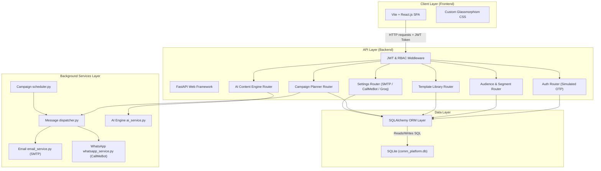

# CommAI: AI-Based Multilingual Mass Communication & Public Awareness Management Platform

CommAI is a full-stack, AI-powered multilingual mass communication and public awareness platform that enables organizations (government departments, healthcare agencies, educational institutions, NGOs, etc.) to target, compose, translate, and schedule communication campaigns across multiple channels (Email, SMS, WhatsApp, Push Notifications, and Web Broadcasts).

---

## 🛠️ Technology Stack

- **Backend**: Python 3.11, FastAPI (web services), SQLAlchemy (ORM), SQLite (local database), Pydantic (validation), Passlib & bcrypt (security), Python-Jose (JWT tokens), Pytest (testing), Requests.
- **Frontend**: React (Vite), JavaScript, custom HTML5/CSS3 (glassmorphic dark theme, custom responsive grid system, micro-animations).
- **Core AI Integration**: Groq API (`llama-3.3-70b-versatile` & `llama-3.1-8b-instant` models).

---

## 📊 System Architecture & Database Design

### 1. Component Architecture


### 2. Entity-Relationship Diagram (ERD)


---

## 🚀 Key Implemented Features

### 1. AI Content Generation & Optimization Engine (Weeks 3-4)
- **Drafting & Structured Prompts**: Generate campaign subject lines and messages using structured, category-specific prompts (Awareness, Emergency, Educational, Announcement).
- **Tone presets**: Toggle between *Urgent*, *Empathetic*, *Formal*, and *Simplified* tones.
- **Audience Personalizer**: Dynamically adapts drafts for *Healthcare Workers*, *Students*, *Rural Audiences*, and *Senior Citizens* based on communication goals.
- **Strict Placeholder Safeguards**: System instructions strictly enforce the preservation of brackets tokens (`{{first_name}}`, `{{city}}`) across all AI optimizations.
- **Offline Compliance & Quality Audit**: Evaluates copy locally against rules (unclosed braces, spam keywords, readability index, sentence length warnings, shouting, duplicates) to output a quality score (0-100) and error/warning flags.
- **Unified Side Panel**: Features a tabbed AI Assist panel in both the Template library and Campaign Wizard. Includes fallback loading indicators and error states.

### 2. Multilingual Pre-Translation Caching & Previews
- **AI Bulk Pre-translations**: One-click command to translate templates into all 22 official regional Indian languages in the background. Caches results into the SQL column for fast dispatches.
- **Pre-translation badges**: Displays pre-generated language flags on template cards in the library.
- **Intelligent Dispatcher Caching**: When broadcasting campaigns, the dispatcher checks the templates cache first. If a match exists, it dispatches immediately without external LLM API dependencies, saving network calls and preventing runtime timeouts.
- **Dynamic Preview Mockups**: Interactive browser and phone screens render previews in 22 regional Indian languages on the fly during campaign setups.

### 3. Direct Campaign Composing & Caret-Position Insertion
- **Direct message option**: Select `-- Write Custom Message (Direct) --` to compose drafts immediately inside the Campaigns Wizard without template binding constraints.
- **Caret Position Tag Insertion**: Click placeholders chips (+Name, +City) to append brackets variables precisely at the current text area cursor/focus caret index.
- **Shadow Templates CRUD**: Writing custom messages automatically creates hidden templates database logs linked to the campaign. Modifying custom drafts updates them, and soft-deleting campaigns or changing template bindings cleans them up automatically.

### 4. Audience Management & Dynamic Segment Builder
- **Dynamic Segment Builder**: Build segment rules with logical AND/OR evaluations.
- **Demographics Breakdowns**: Calculates and displays Language, State, and Occupation distributions within the target segment using visual CSS progress bars.
- **CSV Bulk Importer**: Validates incoming audience imports for duplicates and formats. Automatically stores unrecognized columns in custom JSON metadata.

### 5. Multi-Channel Dispatch Engine & Logs
- **Campaign Background Dispatcher**: Periodically runs campaigns scheduled at a target timestamp.
- **Email Service**: Transmits plain/HTML emails to citizens via SMTP (Gmail or custom).
- **WhatsApp Service**: Transmits notifications via CallMeBot gateway.
- **Delivery Audit Logs**: Tracks sent/failed logs in detail, showing channel, target language, and API error codes.

### 6. Enterprise Governance, Safety Guardrails & Diagnostics (New)
- **Maker-Checker Workflows (Four-Eye Principle)**: Mitigates public relations disasters or panic from typo-ridden emergency alerts. Campaigns targeting $\ge 100$ citizens or categorized as Emergency automatically escalate to `pending_approval` when launched by non-admins, requiring explicit Administrator approval or rejection with documented reason.
- **Opt-Out Suppression Registry (Blacklist)**: Added database schema and CRUD APIs to blacklist unsubscribed emails or phone numbers. The background worker checks this suppressor list automatically to exclude citizens from campaigns.
- **Daily Send Caps**: Configured maximum daily channel send thresholds (`DAILY_CAP_EMAIL`, etc.) to prevent runaway API billing and accidental drainage.
- **Live Integration Diagnostics**: Handshake connectivity check APIs evaluate SMTP handshake health, WhatsApp API keys, and Groq LLM latency (in ms) to map platform parameters on a live dashboard.
- **CSV Data Exporters**: Allows operators to download complete campaign delivery logs and global change history trails into structured CSV spreadsheets directly from the console.
- **Operator User Directory**: Complete management screen for Administrators to create accounts, update roles, reset operator passwords, and revoke access instantly.

---

## ⚙️ Seed & Test Execution

### Seeding Template Collections
To seed a default message template for every single combination of the 5 channels and 4 categories (20 templates total):
```powershell
$env:PYTHONPATH="backend"; .\venv\Scripts\python -m app.seed_all_templates
```

### Seeding Performance Datasets
To load 5,000 randomized recipient entries into the database to check pagination, query filtering, and segments evaluations:
```powershell
$env:PYTHONPATH="backend"; .\venv\Scripts\python backend/app/seed_performance.py
```

### Run Integration Tests
From the root folder, run:
```powershell
$env:PYTHONPATH="backend"; .\venv\Scripts\pytest backend\tests\test_main.py
```

---

## 🐳 Docker Deployment (One-Command Setup)

For immediate launch without installing Python/Node dependencies on your host machine, you can run the entire platform with one command using Docker Compose:

1. From the project root, run:
   ```bash
   docker-compose up --build
   ```
2. Open your browser and navigate to:
   - **Frontend UI**: `http://localhost:5173`
   - **Backend OpenAPI Swagger Docs**: `http://localhost:8000/docs`

---

## 🏃 Local Setup & Launch Instructions (Manual)

### 1. Run Backend Services

1. From the project root, activate the virtual environment:
   ```powershell
   .\venv\Scripts\activate
   ```
2. Navigate to `backend` and run the FastAPI server:
   ```powershell
   cd backend
   python -m uvicorn app.main:app --reload --host 127.0.0.1 --port 8000
   ```
- Swagger documentation: `http://127.0.0.1:8000/docs`
- Database: Creates local `comm_platform.db` in `backend/` folder on launch.

### 2. Run Frontend Services

1. Open a new terminal, navigate to `frontend` folder:
   ```powershell
   cd frontend
   ```
2. Install node modules (if not already done):
   ```powershell
   npm install
   ```
3. Start the Vite React development server:
   ```powershell
   npm run dev
   ```
- Open `http://localhost:5173` in your browser.
- **Admin login**: `admin@comm.ai` / `AdminPassword123!` (OTP bypass code: `123456`)
