# CommAI: AI-Based Multilingual Mass Communication & Public Awareness Management Platform

CommAI is a full-stack, AI-powered multilingual mass communication and public awareness platform that enables organizations (government departments, healthcare agencies, educational institutions, NGOs, etc.) to target, compose, translate, and schedule communication campaigns across multiple channels (Email, SMS, WhatsApp, Push Notifications, and Web Broadcasts).

---

## 🛠️ Technology Stack

- **Backend**: Python 3.11, FastAPI (web services), SQLAlchemy (ORM), SQLite (local database), Pydantic (validation), Passlib & bcrypt (security), Python-Jose (JWT tokens), Pytest (testing), Requests.
- **Frontend**: React (Vite), JavaScript, custom HTML5/CSS3 (glassmorphic dark theme, custom responsive grid system, micro-animations).
- **Core AI Integration**: Groq API (`llama-3.3-70b-versatile` & `llama-3.1-8b-instant` models).

---

## 📊 System Architecture & Database Design

### 1. Component Architecture
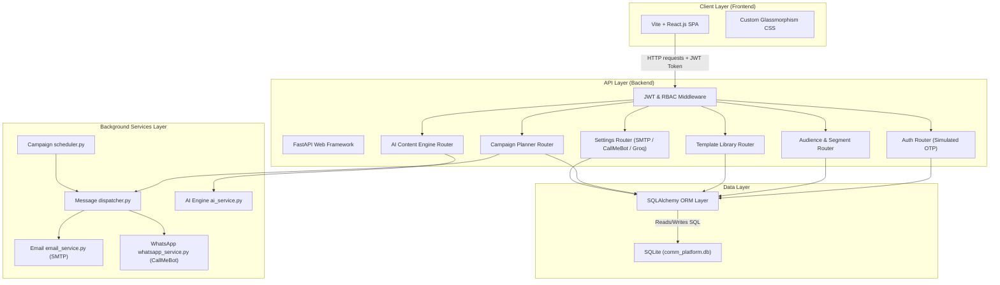

### 2. Entity-Relationship Diagram (ERD)
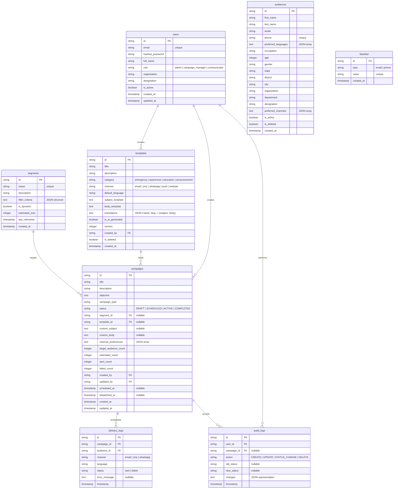

---

## 📅 Week-by-Week Implementation & Screenshots

### Weeks 1–2: Audience Management & Campaign Planning Module

During the first two weeks, the core database models, authentication layer, and interface for managing target citizen segments and communication campaigns were developed:

* **Public Landing Page**: The public-facing entry portal welcoming users and showing general platform features.
  
  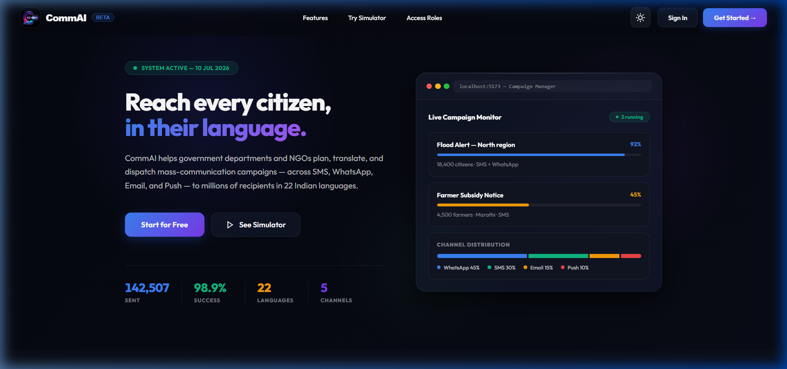

* **Authentication & Role-Based Access Control (RBAC)**: Secure operator sign-in with a mock JWT verification scheme. Features a multi-tiered role model including Administrators, Campaign Managers, and Communicators (Staff).
  
  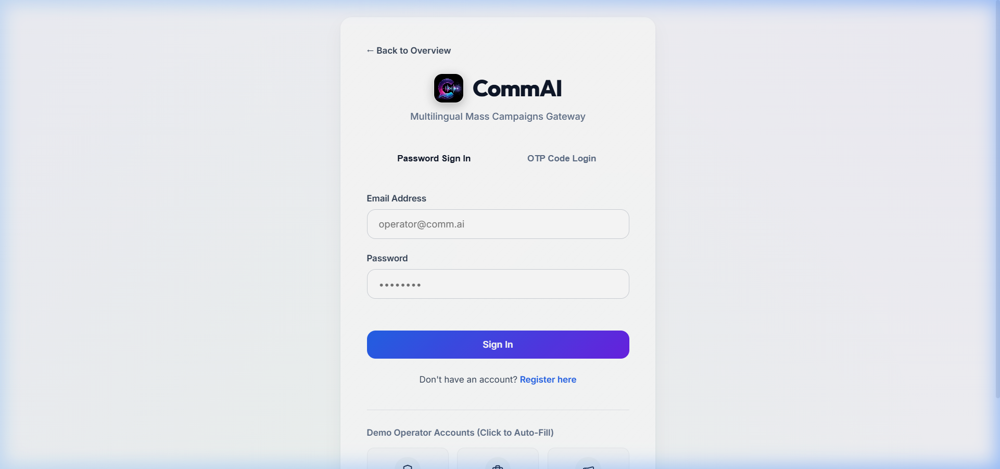

* **Overview Dashboard**: A high-level center showcasing active campaigns, estimated public reach, user directory counts, database segment size, and live integration latency.
  
  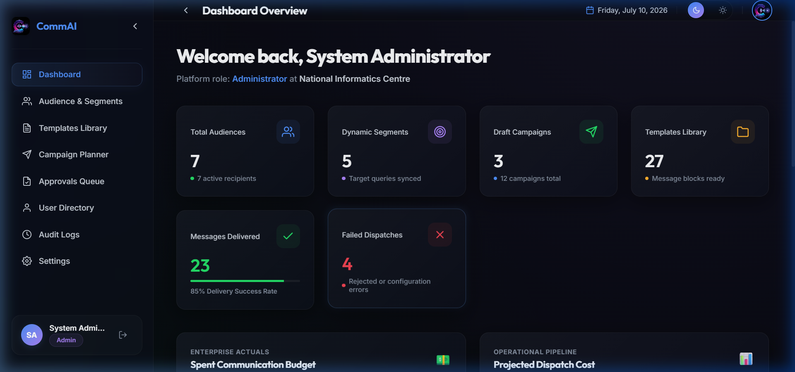

* **Audience Management & Segmentation**: Build targeted groups using a dynamic segment builder with logical query filter criteria (e.g. state, occupation, age group). It displays visual demographic breakdowns (language, state, occupation) using progress indicators.
  
  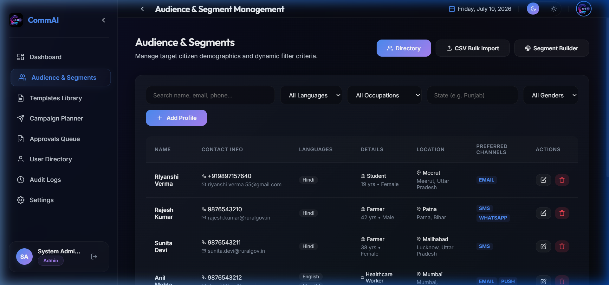

* **Template Library**: A central manager to create, view, edit, and categorize communication templates for various delivery channels (Email, WhatsApp, SMS) and categories (Emergency, Awareness, Education).
  
  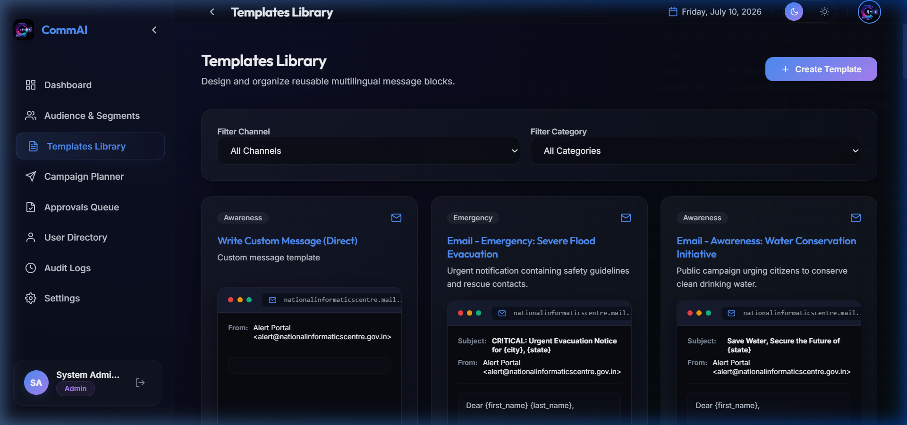

* **Campaign Planner**: A consolidated grid where operators can manage mass communication workflows. Displays the scheduled status, estimated reach, and delivery audits.
  
  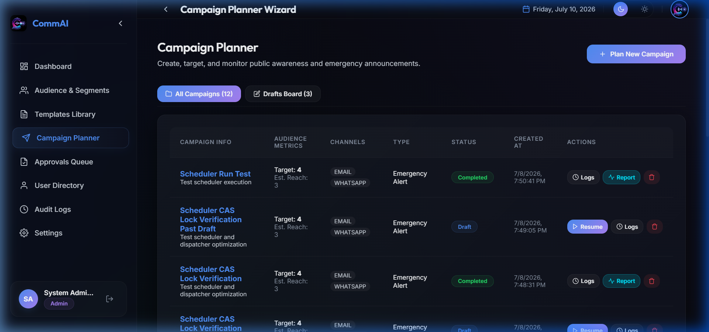

* **Maker-Checker Governance (Four-Eye Principle)**: A safety guardrail that blocks unauthorized or panic-inducing emergency broadcasts. Any campaign targeting $\ge 100$ citizens or marked as `Emergency` requires an Administrator's explicit approval or rejection before dispatching.
  
  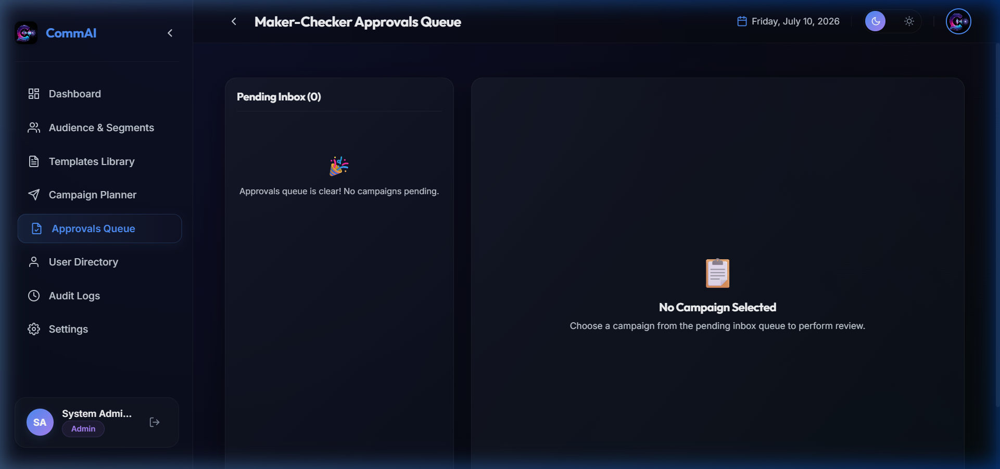

---

### Weeks 3–4: AI Content Generation & Multilingual Communication Engine

In Weeks 3 and 4, we integrated generative artificial intelligence and localization capabilities:

* **Generative AI Side Panel**: Accessible within the Campaign Wizard and Template Library. Utilizes Groq API (`llama-3.3-70b-versatile` & `llama-3.1-8b-instant`) to draft and optimize subjects and bodies.
* **Tone Presets & Audience Personalizer**: Tone overrides (Urgent, Empathetic, Formal, Simplified) and tailored messaging styles for specific demographics (Healthcare Workers, Students, Rural, Seniors).
* **Caret-Position Chip Insertion**: Inserts placeholder variables (`{{first_name}}`, `{{city}}`) at the user's cursor caret position inside text inputs.
* **Multilingual Translation & Previews**: Pre-translates templates into all 22 official regional Indian languages. Dynamic previews render mock mobile and desktop screens in any language on the fly.
* **Offline Compliance & Quality Audit**: Evaluates draft copy locally for sentence length warnings, shouting (excessive caps), duplicate sentences, unclosed brackets, and spam keywords, calculating an overall quality score (0-100).
  
  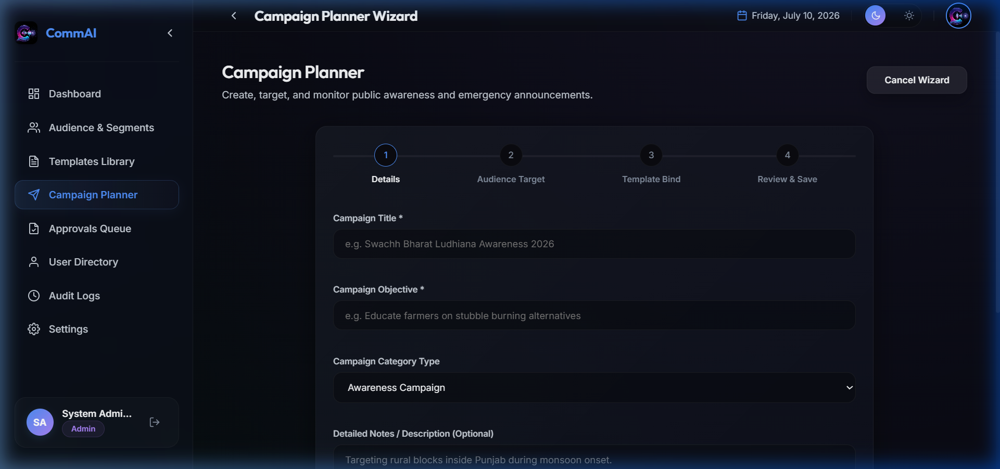

* **System Integration Diagnostics**: A diagnostic dashboard checking connection status and latency (ms) for Groq LLMs, SMTP server handshake, and the CallMeBot WhatsApp API gateway.
  
  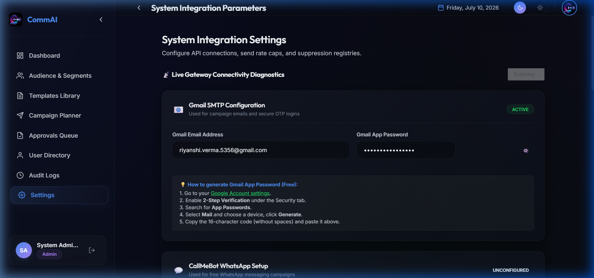

---

### Weeks 5–6: Multi-Channel Distribution & Engagement Analytics Platform
* **Channel Dispatch Service**: Handles SMTP email transmission and CallMeBot WhatsApp message delivery.
* **Automated Background Dispatcher**: Processes and sends scheduled campaigns in the background using a lightweight polling loop.
* **Delivery tracking & Logs**: Detailed logs tracking channel status (sent/failed), recipient language, and error logs.

---

### Weeks 7–8: System Integration, Testing & Project Finalization
* **End-to-End Testing**: Validates segment calculation, AI translation, Maker-Checker locks, and channel dispatch.
* **Suppression Registry**: A global blacklist preventing communication to citizens who opted out.
* **Daily Billing Send Caps**: Enforces absolute daily send caps per channel to prevent runaway API fees.

---

## ⚙️ Seed & Test Execution

### Seeding Template Collections
To seed a default message template for every single combination of the 5 channels and 4 categories (20 templates total):
```powershell
$env:PYTHONPATH="backend"; .\venv\Scripts\python -m app.seed_all_templates
```

### Seeding Performance Datasets
To load 5,000 randomized recipient entries into the database to check pagination, query filtering, and segments evaluations:
```powershell
$env:PYTHONPATH="backend"; .\venv\Scripts\python backend/app/seed_performance.py
```

### Run Integration Tests
From the root folder, run:
```powershell
$env:PYTHONPATH="backend"; .\venv\Scripts\pytest backend\tests\test_main.py
```

---

## 🐳 Docker Deployment (One-Command Setup)

For immediate launch without installing Python/Node dependencies on your host machine, you can run the entire platform with one command using Docker Compose:

1. From the project root, run:
   ```bash
   docker-compose up --build
   ```
2. Open your browser and navigate to:
   - **Frontend UI**: `http://localhost:5173`
   - **Backend OpenAPI Swagger Docs**: `http://localhost:8000/docs`

---

## 🏃 Local Setup & Launch Instructions (Manual)

### 1. Run Backend Services

1. From the project root, activate the virtual environment:
   ```powershell
   .\venv\Scripts\activate
   ```
2. Navigate to `backend` and run the FastAPI server:
   ```powershell
   cd backend
   python -m uvicorn app.main:app --reload --host 127.0.0.1 --port 8000
   ```
- Swagger documentation: `http://127.0.0.1:8000/docs`
- Database: Creates local `comm_platform.db` in `backend/` folder on launch.

### 2. Run Frontend Services

1. Open a new terminal, navigate to `frontend` folder:
   ```powershell
   cd frontend
   ```
2. Install node modules (if not already done):
   ```powershell
   npm install
   ```
3. Start the Vite React development server:
   ```powershell
   npm run dev
   ```
- Open `http://localhost:5173` in your browser.
- **Admin login**: `admin@comm.ai` / `AdminPassword123!` (OTP bypass code: `123456`)
