# CommAI: AI-Based Multilingual Mass Communication & Public Awareness Management Platform

[](#-milestone-2-completed-features)
[](https://python.org)
[](https://fastapi.tiangolo.com)
[](https://reactjs.org)
[](https://docker.com)

**CommAI** is a full-stack, AI-powered multilingual mass communication and public awareness platform that enables organizations (government departments, healthcare agencies, educational institutions, emergency services, NGOs) to target, compose, translate, broadcast, and monitor public campaigns across multiple channels (Email, SMS, WhatsApp, Push Notifications, Voice Bulletins, and Interactive Web Portals).

---

## 🏆 MILESTONE 2: COMPLETED FEATURES & ADVANCED ENHANCEMENTS

Milestone 2 expands CommAI into a production-grade, multi-modal emergency broadcast and public engagement platform with neural speech synthesis, real-time WebSocket chimes, multi-tiered AI translation failovers, poster graphics generation, and strict governance safety controls.

### 1. 🔊 Neural Indic AI Voice Bulletin Engine (23 Official Languages)
- **Microsoft Edge Neural Speech Integration**: High-fidelity neural voice models for Indic languages (`hi-IN-MadhurNeural`, `hi-IN-SwaraNeural`, `bn`, `ta`, `te`, `mr`, `gu`, `kn`, `ml`, `ur`, `en`).
- **Zero-Downtime Speech Fallback (`gTTS`)**: Automatic failover to Google Text-to-Speech for regional dialects (`pa`, `or`, `as`, `ne`, `sd`, `sa`, etc.).
- **Multi-Tier Translation Service**: Zero-cost fallback pipeline combining primary Groq LLM (`llama-3.3-70b-versatile`), secondary Groq key (`llama-3.1-8b-instant`), and Google GTX Translate API.
- **React Portal Glassmorphism Voice Player**: Floating modal rendered directly via `ReactDOM.createPortal` on `document.body` to prevent CSS clipping/overlap on any dashboard card, high-contrast bold speech scripts, speed controls (`0.75x`, `1x`, `1.25x`), and instant multi-language audio streaming.

### 2. 🎨 AI Visual Poster Studio & Served Binary Image Endpoint
- **Canvas Composite Engine**: Custom composite system overlaying multilingual typography, emergency headers, and official seals on AI-generated background imagery.
- **Served Binary Images**: Dedicated binary image streaming endpoint (`/api/poster/{id}/image`) to prevent CORS issues, enable fast caching, and support direct inline previews.

### 3. 📧 Inline Email Image Attachments (CID & Credentials Helper)
- **Inline MIME Attachments**: Automatically parses and attaches poster media files in emails as inline MIME attachments (`cid:` references).
- **Credentials Normalization**: Automatic credentials normalization helper (Gmail App Password space-stripping and validation) to prevent SMTP authentication failures.

### 4. ⚡ Real-Time WebSocket Alert Engine & Audio Broadcast Chimes
- **Live Broadcast Listeners**: WebSockets attached to citizen and operator dashboards that trigger real-time toast popups and audio chime notifications whenever an emergency flyer or bulletin is published.
- **Zero-Reload Updates**: Dynamically updates active campaign lists and alert feeds without requiring manual page refreshes.

### 5. 🛡️ Maker-Checker Four-Eye Governance System
- **Emergency Safety Guardrails**: Prevents unauthorized or panic-inducing emergency broadcasts. Any campaign targeting $\ge 100$ citizens or marked as `Emergency` requires explicit Administrator approval/rejection before dispatching.
- **Audit Trails**: Full audit logging for every administrative review action.

### 6. 📊 Sentiment Map & Interactive Geographic Analytics
- **Geospatial Intelligence**: District-level citizen sentiment map and interactive feedback heatmap analytics for public feedback tracking.

---

## 🛠️ Technology Stack

- **Backend**: Python 3.11, FastAPI (web services), SQLAlchemy (ORM), SQLite (local database), Pydantic (validation), Passlib & bcrypt (security), Python-Jose (JWT tokens), Pytest (testing), Edge-TTS, gTTS, Requests.
- **Frontend**: React (Vite), JavaScript, custom HTML5/CSS3 (glassmorphic dark theme, custom responsive grid system, micro-animations).
- **Core AI Integration**: Groq API (`llama-3.3-70b-versatile` & `llama-3.1-8b-instant` models) with multi-tier fallback.

---

## 📊 System Architecture & Database Design

### 1. Component Architecture

```mermaid
graph TD
    subgraph client_layer ["Client Layer (Frontend)"]
        ReactApp["Vite + React.js SPA"]
        VanillaCSS["Custom Glassmorphism CSS"]
        VoicePlayer["React Portal Voice Bulletin Player"]
    end

    subgraph api_layer ["API Layer (Backend)"]
        FastAPI["FastAPI Web Framework"]
        AuthMiddleware["JWT & RBAC Middleware"]
        RouterAuth["Auth Router (Simulated OTP)"]
        RouterAudience["Audience & Segment Router"]
        RouterTemplate["Template Library Router"]
        RouterCampaign["Campaign Planner Router"]
        RouterVoice["Voice Bulletin Router"]
        RouterSettings["Settings Router (SMTP / CallMeBot / Groq)"]
        RouterAI["AI Content Engine Router"]
        RouterEmergency["Emergency Contact Router"]
    end

    subgraph services_layer ["Background & AI Services Layer"]
        Scheduler["Campaign scheduler.py"]
        Dispatcher["Message dispatcher.py"]
        EmailService["Email email_service.py (SMTP + CID Attachments)"]
        WAService["WhatsApp whatsapp_service.py (CallMeBot)"]
        VoiceService["Voice Service voice_service.py (Edge-TTS + gTTS)"]
        TranslationService["Translation Service translation_service.py (Groq + GTX)"]
        AIService["AI Engine ai_service.py"]
    end

    subgraph data_layer ["Data Layer"]
        SQLAlchemy["SQLAlchemy ORM Layer"]
        SQLite["SQLite (comm_platform.db)"]
        AudioCache["Static Audio Cache MP3s"]
    end

    ReactApp -->|HTTP requests + JWT Token| AuthMiddleware
    AuthMiddleware --> RouterAuth
    AuthMiddleware --> RouterAudience
    AuthMiddleware --> RouterTemplate
    AuthMiddleware --> RouterCampaign
    AuthMiddleware --> RouterVoice
    AuthMiddleware --> RouterSettings
    AuthMiddleware --> RouterAI
    AuthMiddleware --> RouterEmergency

    RouterCampaign --> Dispatcher
    Scheduler --> Dispatcher
    Dispatcher --> EmailService
    Dispatcher --> WAService

    RouterVoice --> VoiceService
    VoiceService --> TranslationService
    VoiceService --> AudioCache

    RouterAI --> AIService

    RouterAuth --> SQLAlchemy
    RouterAudience --> SQLAlchemy
    RouterTemplate --> SQLAlchemy
    RouterCampaign --> SQLAlchemy
    RouterSettings --> SQLAlchemy
    RouterEmergency --> SQLAlchemy

    SQLAlchemy -->|Reads/Writes SQL| SQLite
```


---

## 📅 Week-by-Week Implementation Summary

### Weeks 1–2: Audience Management & Campaign Planning Module
- **Public Landing Page**: Public-facing entry portal welcoming users and displaying active bulletins.
- **Authentication & RBAC**: Secure operator sign-in with JWT verification scheme and multi-tiered roles (Admin, Campaign Manager, Communicator).
- **Overview Dashboard**: High-level telemetry for active campaigns, public reach, segment size, and live integration latency.
- **Audience Management & Segmentation**: Dynamic segment builder with logical query filter criteria (state, occupation, age, preferred language).
- **Template Library**: Central repository to manage templates across delivery channels (Email, WhatsApp, SMS) and categories.
- **Campaign Planner**: Consolidated grid for scheduled broadcasts and delivery audits.

### Weeks 3–4: AI Content Generation & Multilingual Engine
- **Generative AI Assistant**: Groq API integration for drafting optimized campaign subjects and body copy.
- **Tone Presets & Personalization**: Tone overrides (Urgent, Empathetic, Formal, Simplified) and demographic targeting.
- **Caret-Position Chip Insertion**: Inserts placeholder variables (`{{first_name}}`, `{{city}}`) at the cursor caret position.
- **Multilingual Previews**: Dynamic previews for 22 official regional Indian languages.
- **Emergency Inbox & AI Response**: Citizen emergency inquiry tracking with automated AI response drafting.

### Weeks 5–6: Multi-Channel Distribution & Analytics
- **Channel Dispatch Service**: SMTP email transmission and CallMeBot WhatsApp delivery.
- **Automated Background Dispatcher**: Background polling loop processing scheduled broadcasts.
- **Delivery Logs & Auditing**: Tracking channel status, language, and error logs.

### Weeks 7–8: Milestone 2 Finalization, Speech & Visual Engine
- **Neural Voice Bulletin Player**: Edge-TTS + gTTS synthesis supporting 23 official languages with React Portal modal controls.
- **AI Visual Poster Studio**: Canvas composite system serving binary image flyers via `/api/poster/{id}/image`.
- **Inline Email Attachments**: Automatic MIME CID image attachments and Gmail App Password credential normalization.
- **Real-Time WebSocket Alerts**: Live dashboard alert broadcasts with sound chimes and instant list refreshes.
- **Maker-Checker Governance**: Four-eye principle approval queue for emergency broadcasts ($\ge 100$ recipients).

---

## ⚙️ Seed & Test Execution

### Seeding Template Collections
To seed default message templates across all channels and categories:
```powershell
$env:PYTHONPATH="backend"; .\venv\Scripts\python -m app.seed_all_templates
```

### Seeding Performance Datasets
To load 5,000 recipient records into the database:
```powershell
$env:PYTHONPATH="backend"; .\venv\Scripts\python backend/app/seed_performance.py
```

### Run Integration Tests
From the root folder:
```powershell
$env:PYTHONPATH="backend"; .\venv\Scripts\pytest backend\tests\
```

---

## 🐳 Docker Deployment (One-Command Setup)

Run the entire platform with one command using Docker Compose:

1. From the project root:
   ```bash
   docker-compose up --build
   ```
2. Access services at:
   - **Frontend UI**: `http://localhost:5173`
   - **Backend OpenAPI Swagger Docs**: `http://localhost:8001/docs`

---

## 🏃 Local Setup & Launch Instructions (Manual)

### 1. Run Backend Services
```powershell
cd backend
.\venv\Scripts\activate
python -m uvicorn app.main:app --reload --host 127.0.0.1 --port 8001
```
- Swagger documentation: `http://127.0.0.1:8001/docs`

### 2. Run Frontend Services
```powershell
cd frontend
npm install
npm run dev
```
- Frontend UI: `http://localhost:5173`
- **Admin login**: `admin@example.com` / `AdminPassword123!` (OTP code: `123456`)
