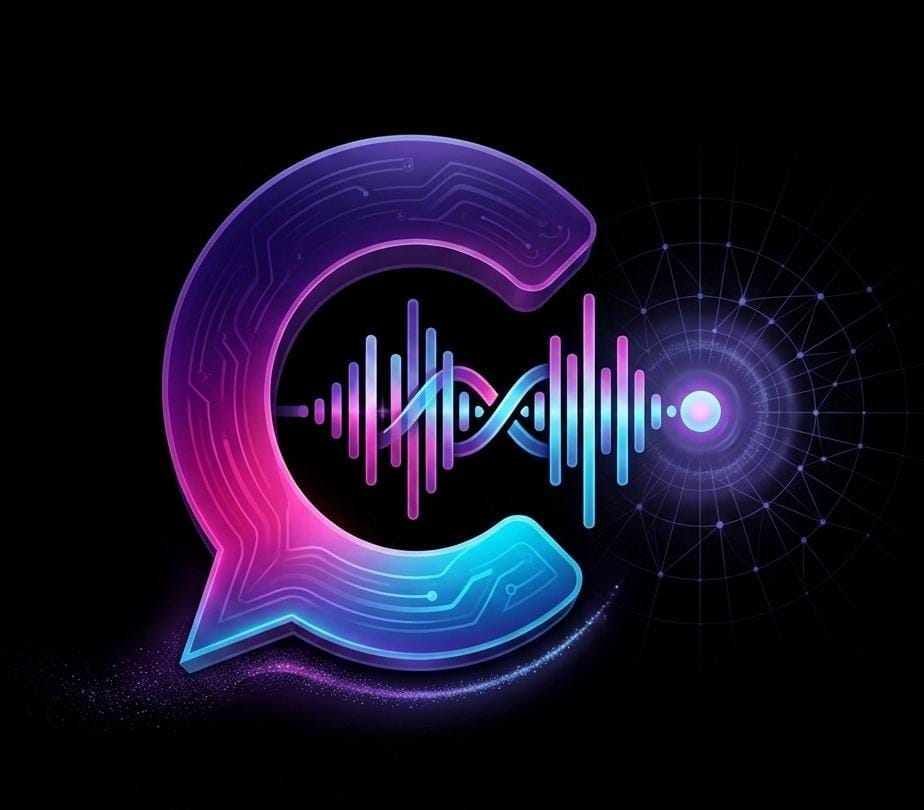
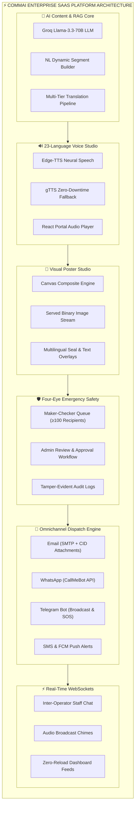
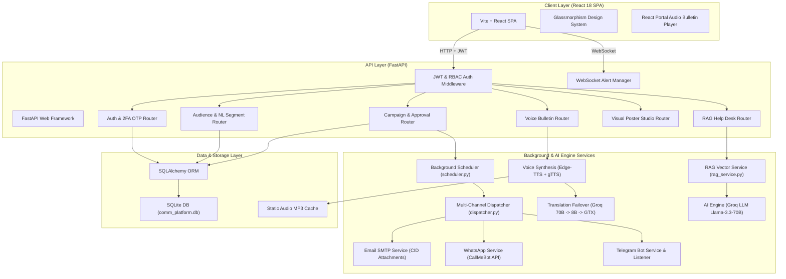
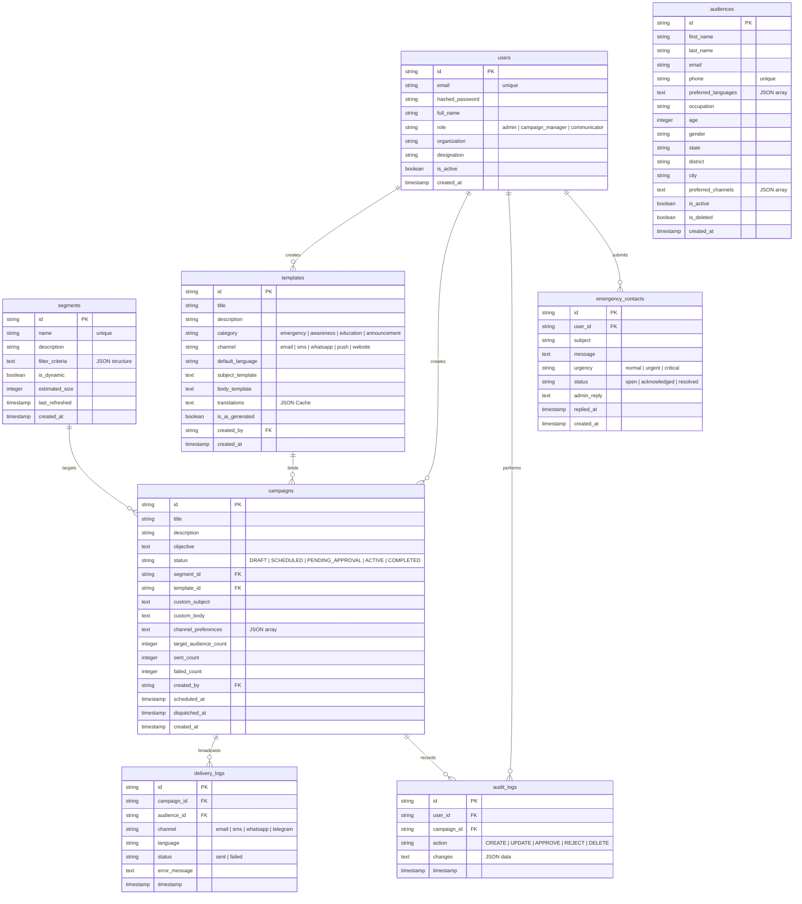
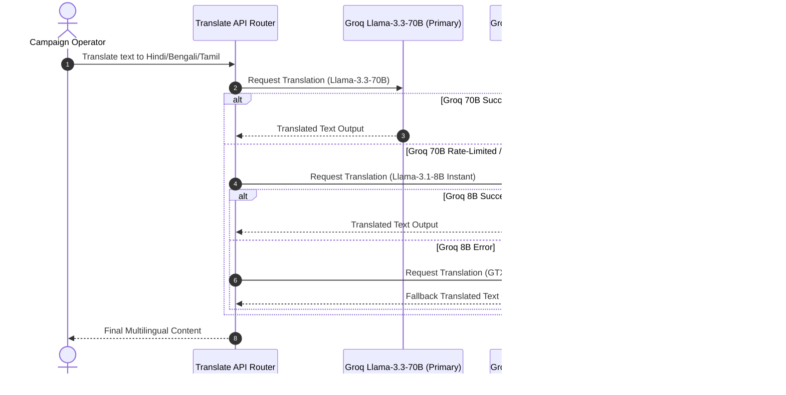

# CommAI: Enterprise Multilingual Mass Communication & Emergency Public Awareness SaaS Platform



### *Empowering Organizations with AI-Driven Multilingual Outreach, Omnichannel Dispatch & Four-Eye Emergency Governance*

[](LICENSE)
[](https://python.org)
[](https://fastapi.tiangolo.com)
[](https://reactjs.org)
[](https://vitejs.dev)
[](https://groq.com)
[](https://docker.com)

[**Explore Features**](#-core-saas-feature-pillars) • [**Visual Screenshot Tour**](#-interactive-visual-tour--screenshots) • [**Architecture & ERD**](#-system-architecture--data-engineering) • [**API Specs**](#-api-specification--gateway-matrix) • [**Quick Start**](#-getting-started--deployment-guide)

---

## 🌟 Executive Overview & Product Vision

**CommAI** is an enterprise-grade, AI-powered multilingual mass communication and emergency public awareness SaaS platform. Built for government departments, healthcare institutions, disaster relief bodies, municipal smart cities, and non-profits, CommAI solves the critical challenges of language barriers, delayed alert dispatches, fragmented communication channels, and unverified panic broadcasts.

By combining state-of-the-art **Large Language Models (Groq Llama-3.3-70B)**, **Retrieval-Augmented Generation (RAG)**, **Neural Speech Synthesis across 23 Indic Languages**, **AI Visual Poster Generation**, and an **Omnichannel Engine (Email, SMS, WhatsApp, Telegram, Push, and Audio Bulletins)**, CommAI empowers communicators to instantly compose, localize, verify, and broadcast high-impact public awareness campaigns.


```mermaid
graph TD
    subgraph Platform ["⚡ COMMAI ENTERPRISE SAAS PLATFORM ARCHITECTURE"]
        direction TB
        
        subgraph CoreAI ["🤖 AI Content & RAG Core"]
            AI1["Groq Llama-3.3-70B LLM"]
            AI2["NL Dynamic Segment Builder"]
            AI3["Multi-Tier Translation Pipeline"]
        end
        
        subgraph VoiceStudio ["🔊 23-Language Voice Studio"]
            V1["Edge-TTS Neural Speech"]
            V2["gTTS Zero-Downtime Fallback"]
            V3["React Portal Audio Player"]
        end

        subgraph DispatchEngine ["📡 Omnichannel Dispatch Engine"]
            D1["Email (SMTP + CID Attachments)"]
            D2["WhatsApp (CallMeBot API)"]
            D3["Telegram Bot (Broadcast & SOS)"]
            D4["SMS & FCM Push Alerts"]
        end

        subgraph Governance ["🛡️ Four-Eye Emergency Safety"]
            G1["Maker-Checker Queue (≥100 Recipients)"]
            G2["Admin Review & Approval Workflow"]
            G3["Tamper-Evident Audit Logs"]
        end

        subgraph PosterStudio ["🎨 Visual Poster Studio"]
            P1["Canvas Composite Engine"]
            P2["Served Binary Image Stream"]
            P3["Multilingual Seal & Text Overlays"]
        end

        subgraph RealtimeWS ["⚡ Real-Time WebSockets"]
            W1["Inter-Operator Staff Chat"]
            W2["Audio Broadcast Chimes"]
            W3["Zero-Reload Dashboard Feeds"]
        end
    end

    CoreAI --> VoiceStudio
    VoiceStudio --> PosterStudio
    PosterStudio --> Governance
    Governance --> DispatchEngine
    DispatchEngine --> RealtimeWS
```

```
┌──────────────────────────────────────────────────────────────────────────────────────────────────┐
│                                 ⚡ COMMAI ENTERPRISE SAAS PLATFORM                                │
├──────────────────────────────┬──────────────────────────────┬────────────────────────────────────┤
│ 🤖 AI Content & RAG Core     │ 🔊 23-Language Voice Studio  │ 📡 Omnichannel Dispatch Engine     │
│ • Groq Llama-3.3-70B LLM     │ • Edge-TTS Neural Synthesis  │ • Email (SMTP + CID Attachments)   │
│ • NL Dynamic Segment Builder │ • Zero-Downtime gTTS         │ • WhatsApp (CallMeBot Gateway)     │
│ • RAG Vector Knowledge Base  │ • React Portal Audio Player  │ • Telegram Bot (Broadcast & SOS)   │
│ • Multi-Tier Translation     │ • Line-by-Line Script Track  │ • SMS & FCM Push Alerts            │
├──────────────────────────────┼──────────────────────────────┼────────────────────────────────────┤
│ 🛡️ Four-Eye Governance       │ 🎨 Visual Poster Studio      │ ⚡ Real-Time WebSocket Alerts      │
│ • Maker-Checker Queue (≥100) │ • Canvas Composite Engine    │ • Inter-Operator Staff Chat        │
│ • Admin Review & Approval    │ • Served Binary Image Stream │ • Audio Broadcast Chimes           │
│ • Audit Log Compliance       │ • Typography & Seal Overlays │ • Zero-Reload Dashboard Feeds      │
└──────────────────────────────┴──────────────────────────────┴────────────────────────────────────┘
```

---

## ⚡ Core SaaS Feature Pillars

### 1. 🔑 Enterprise Security & Real-Time Email 2FA OTP Authentication
- **Multi-Factor Authentication (MFA)**: Secure operator sign-in enforced by JWT access tokens and real-time email 2FA OTP verification. Upon login request, a dynamic 6-digit verification code is instantly generated and delivered directly to the user's registered email inbox via SMTP, supported by active expiration timers, cache invalidation, and resend protection.
- **Granular Role-Based Access Control (RBAC)**: Distinct permissions for `admin`, `campaign_manager`, and `communicator` user roles.
- **Self-Service Password Recovery**: Secure self-service password reset flow (`/api/auth/forgot-password-request` & `/api/auth/reset-password`) using email OTP verification codes.
- **Blacklist & Unsubscribe Management**: Dynamic blacklist filtering (Email and Phone opt-outs) protecting recipient privacy and regulatory compliance.

### 2. 🤖 AI Intelligence, Copywriting & RAG Knowledge Engine
- **Groq LLM Core & Tone Adaptations**: Powered by Groq's `llama-3.3-70b-versatile` and `llama-3.1-8b-instant` models. Supports 4 tone presets (*Urgent Emergency*, *Formal Advisory*, *Empathetic Support*, *Informative Announcement*), target length selection, key point expansion, and 3-variant AI subject line generation.
- **Natural Language Dynamic Audience Builder (`nl_segment.py`)**: Allows operators to type natural language queries (e.g., *"Senior citizens living in Pune district who prefer Marathi"*) and automatically translates them into SQL segment rules.
- **RAG Knowledge Base (`rag_service.py`)**: Embedded vector retrieval system indexing official government circulars, health advisory PDFs, and emergency guidelines for auto-answering citizen queries.
- **Multi-Tier Zero-Downtime Translation Pipeline**: Failover sequence: Primary Groq 70B $\rightarrow$ Secondary Groq 8B $\rightarrow$ Google GTX Translate API across 23 official Indic languages.

<div style="background: linear-gradient(135deg, #0f172a 0%, #1e1b4b 50%, #0f172a 100%); padding: 28px; border-radius: 24px; border: 2px solid #8b5cf6; box-shadow: 0 15px 35px rgba(139, 92, 246, 0.35); margin: 25px 0;">

  <h2 style="color: #c084fc; margin-top: 0; font-size: 1.85rem; text-shadow: 0 0 15px rgba(192, 132, 252, 0.5); text-align: left;">
    🎙️ ⚡ COMMAI VOICE COCKPIT & HANDS-FREE JARVIS AI <br/>
    <span style="color: #38bdf8; font-size: 1.1rem; text-transform: uppercase; letter-spacing: 2px;">⭐ THE PLATFORM'S FLAGSHIP KILLER FEATURE ⭐</span>
  </h2>

  <p style="color: #ffffff; font-size: 1.05rem; line-height: 1.6; margin: 0 0 20px 0; font-weight: 500; text-align: left;">
    A revolutionary hands-free AI voice assistant that lets Admins & Campaign Managers control broadcasts, navigate emergency modules, target audience segments, and dictate localized messaging—all using natural voice interaction.
  </p>

  <table width="100%" style="border-collapse: collapse; border: none; text-align: left;">
    <tr>
      <td width="50%" style="padding: 10px; vertical-align: top;">
        <div style="background: rgba(139, 92, 246, 0.18); border-left: 4px solid #a78bfa; padding: 14px; border-radius: 12px;">
          <h4 style="margin: 0 0 6px 0; color: #e9d5ff; font-size: 1.05rem; font-weight: 700;">
            🔊 Hands-Free Wake-Word Detection ("Hey Jarvis")
          </h4>
          <p style="margin: 0; color: #ffffff; font-size: 0.9rem; line-height: 1.55;">
            Continuous background listener on Admin & Manager dashboards monitoring for <code style="color: #e9d5ff; background: rgba(255,255,255,0.15); padding: 2px 6px; border-radius: 4px;">"Hey Jarvis"</code> or <code style="color: #e9d5ff; background: rgba(255,255,255,0.15); padding: 2px 6px; border-radius: 4px;">"Hey Jarvis AI"</code>. Automatically slides open the Voice Cockpit hands-free and greets the manager verbally.
          </p>
        </div>
      </td>
      <td width="50%" style="padding: 10px; vertical-align: top;">
        <div style="background: rgba(6, 182, 212, 0.18); border-left: 4px solid #38bdf8; padding: 14px; border-radius: 12px;">
          <h4 style="margin: 0 0 6px 0; color: #bae6fd; font-size: 1.05rem; font-weight: 700;">
            🔄 Continuous Speech Dialogue & Auto-Mic Loop
          </h4>
          <p style="margin: 0; color: #ffffff; font-size: 0.9rem; line-height: 1.55;">
            CommAI speaks all status updates, AI-generated responses, and campaign summaries aloud via SpeechSynthesis. Right after speaking, the microphone <b style="color: #38bdf8;">AUTOMATICALLY opens in recording mode</b> by default for seamless follow-up commands.
          </p>
        </div>
      </td>
    </tr>
    <tr>
      <td width="50%" style="padding: 10px; vertical-align: top;">
        <div style="background: rgba(16, 185, 129, 0.18); border-left: 4px solid #34d399; padding: 14px; border-radius: 12px;">
          <h4 style="margin: 0 0 6px 0; color: #a7f3d0; font-size: 1.05rem; font-weight: 700;">
            👥 Dynamic Recipient Directory & Location Intelligence
          </h4>
          <p style="margin: 0; color: #ffffff; font-size: 0.9rem; line-height: 1.55;">
            Parses spoken locations (e.g. <i style="color: #6ee7b7;">Uttar Pradesh, Assam, Varanasi</i>) and dynamically loads individual recipient names (e.g. <i style="color: #6ee7b7;">Riyanshi Verma, Nidhi Sharma, Palak, Yashvi, Ramesh Sharma</i>) + target segments into interactive review dropdowns.
          </p>
        </div>
      </td>
      <td width="50%" style="padding: 10px; vertical-align: top;">
        <div style="background: rgba(245, 158, 11, 0.18); border-left: 4px solid #fbbf24; padding: 14px; border-radius: 12px;">
          <h4 style="margin: 0 0 6px 0; color: #fde68a; font-size: 1.05rem; font-weight: 700;">
            🤖 Groq 70B AI Campaign Copy Generation
          </h4>
          <p style="margin: 0; color: #ffffff; font-size: 0.9rem; line-height: 1.55;">
            Instantly generates production-ready campaign copy (Catchy Title, Strategic Objective, Email/Push Subject Line, and Detailed Message Body with <code style="color: #fde68a; background: rgba(255,255,255,0.15); padding: 2px 6px; border-radius: 4px;">{{first_name}}</code> placeholders).
          </p>
        </div>
      </td>
    </tr>
    <tr>
      <td width="50%" style="padding: 10px; vertical-align: top;">
        <div style="background: rgba(236, 72, 153, 0.18); border-left: 4px solid #f472b6; padding: 14px; border-radius: 12px;">
          <h4 style="margin: 0 0 6px 0; color: #fbcfe8; font-size: 1.05rem; font-weight: 700;">
            🚀 One-Click Wizard Co-Pilot & Direct Broadcast
          </h4>
          <p style="margin: 0; color: #ffffff; font-size: 0.9rem; line-height: 1.55;">
            Clicking <code style="color: #fbcfe8; background: rgba(255,255,255,0.15); padding: 2px 6px; border-radius: 4px;">✏️ Edit Wizard</code> populates the campaign planner wizard instantly, while <code style="color: #fbcfe8; background: rgba(255,255,255,0.15); padding: 2px 6px; border-radius: 4px;">🚀 Proceed / Confirm Broadcast</code> dispatches alerts directly.
          </p>
        </div>
      </td>
      <td width="50%" style="padding: 10px; vertical-align: top;">
        <div style="background: rgba(239, 68, 68, 0.18); border-left: 4px solid #f87171; padding: 14px; border-radius: 12px;">
          <h4 style="margin: 0 0 6px 0; color: #fecdd3; font-size: 1.05rem; font-weight: 700;">
            🛑 Explicit Recording Controls
          </h4>
          <p style="margin: 0; color: #ffffff; font-size: 0.9rem; line-height: 1.55;">
            Features a prominent <code style="color: #fecdd3; background: rgba(255,255,255,0.15); padding: 2px 6px; border-radius: 4px;">🛑 Stop Recording</code> button and visual audio wave animations for manual recording control anytime.
          </p>
        </div>
      </td>
    </tr>
  </table>

  <div style="margin: 20px 0 10px 0; text-align: left;">
    
    <br/>
    <span style="color: #e2e8f0; font-size: 0.88rem; font-style: italic;">🎙️ CommAI Voice Cockpit & Hands-Free Jarvis AI Action Center</span>
  </div>

</div>

### 3. 🔊 Neural Indic AI Voice Bulletin & Voice Assistant Widget (23 Languages)
- **High-Fidelity Neural Speech**: Integrates Microsoft Edge Neural Speech synthesis for 23 languages (the 22 Official Scheduled Languages of India + English: `hi-IN`, `bn`, `ta`, `te`, `mr`, `gu`, `kn`, `ml`, `ur`, `pa`, `or`, `as`, `ne`, `sd`, `sa`, `mai`, `sat`, `ks`, `kok`, `doi`, `mni`, `brx`, `en`).
- **Zero-Downtime gTTS & Twilio Voice Call Engine**: Automatic regional dialect fallback using Google Text-to-Speech and automated outbound emergency phone calls via Twilio Voice REST API & TwiML.
- **React Portal Glassmorphic Audio Player**: Rendered dynamically via `ReactDOM.createPortal` directly on `document.body` to eliminate z-index clipping across dashboard views. Features variable playback speed (`0.75x`, `1.0x`, `1.25x`), line-by-line synchronized script highlighting, and live audio streaming.
- **Multilingual AI Voice Assistant Widget (`ChatbotWidget.jsx`)**: Floating interactive voice assistant supporting Web Speech API speech recognition across 13 Indian languages (`hi-IN`, `ta-IN`, `te-IN`, `mr-IN`, `bn-IN`, `gu-IN`, `kn-IN`, `ml-IN`, `pa-IN`, `or-IN`, `ur-IN`, `as-IN`, `en-IN`), hands-free voice campaign composition, audio readout, and instant SOS escalation.

### 4. 🎨 AI Visual Poster Studio & Served Binary Endpoint
- **HTML5 Canvas Composite Engine**: Overlays localized emergency headlines, official agency seals, and dynamic typography onto background images.
- **Served Binary Image Preview (`/api/poster/{id}/image`)**: Custom binary streaming endpoint preventing CORS errors, optimizing client caching, and enabling direct inline previewing across dashboards and emails.

### 5. 📡 Omnichannel Mass Dispatch & Two-Way Listener Engine
- **Email Gateway**: SMTP dispatch featuring automatic Gmail App Password space-stripping, credentials normalization, and inline MIME CID image attachments (`cid:poster.png`).
- **WhatsApp Integration**: Direct messaging gateway via CallMeBot API.
- **Telegram Bot & Auto Contact Matcher (`telegram_bot_listener.py`)**: Automated channel broadcasting (`telegram_service.py`) and interactive contact sharing listener. Prompts citizens to share their phone number to automatically link their `telegram_chat_id` to their audience record without manual entry.
- **Two-Way Citizen Webhook Engine (`webhook.py`)**: Inbound SMS/WhatsApp webhook listener (`/api/webhook/citizen-reply`) that resolves citizen identity, executes vector RAG search (`rag_service.py`), and automatically returns contextual AI answers.
- **Omnichannel Citizen Dialogue Portal (`CitizenConversations.jsx`)**: Operator dashboard for inspecting full two-way chat threads, viewing RAG auto-replies, and sending manual operator overrides (`/api/webhook/manual-reply`).
- **SMS & FCM Push Notifications**: Integrated SMS gateway and Firebase Cloud Messaging (FCM) push notification engine.

### 6. 🛡️ Enterprise Maker-Checker Governance (Four-Eye Principle) & CSV Auditing
- **Emergency Safety Guardrails**: Prevents unauthorized broadcasts or accidental panic dispatches. Any campaign targeting $\ge 100$ citizens or marked with `Emergency` status is automatically routed to the Approvals Queue.
- **Mandatory Approval / Rejection Workflow**: Requires explicit Administrator review, approval, or rejection (with mandatory reason notes) before any delivery worker dispatches messages.
- **Compliance Audit Logging (`audit_logs`) & CSV Export**: Tamper-evident logging of every platform action with dedicated one-click CSV export endpoints (`/api/campaigns/audit-logs/export/all` and `/api/campaigns/{id}/export-delivery-logs`).

### 7. 🗺️ Geospatial Intelligence & Campaign Feedback Analytics
- **District-Level Sentiment Map**: Real-time visual tracking of citizen sentiment and feedback across states and districts.
- **Interactive Emergency Heatmap**: Geospatial analytics visualizing public reaction density, emergency ticket concentrations, and campaign reach.
- **Citizen Campaign Feedback Engine (`feedback.py`)**: Structured rating system (`helpful`, `excellent`, `confusing`, `too_frequent`, `not_relevant`) with automatic score aggregation.

### 8. ⚡ Real-Time WebSocket Alert Engine & Gateway Diagnostics
- **Live Inter-Operator Staff Chat**: Real-time WebSocket chat room for broadcast team coordination, complete with role badges, online status indicators, and sound notifications.
- **Broadcast Sound Chimes & Zero-Reload Feeds**: Real-time WebSocket listeners updating citizen portals and operator feeds instantly without manual page refreshes.
- **System Gateway Diagnostics (`settings.py` & `Settings.jsx`)**: Live ping latency diagnostics and integration test triggers for Groq AI, SMTP Email, CallMeBot WhatsApp, FCM Push, and Telegram Bot gateways.

---

## 🖼️ Interactive Visual Tour & Screenshots

### 🏆 Core Platform Foundation & Governance

| Public Landing Page | Login & 2FA OTP Verification |
| :--- | :--- |
|  |  |
| *Public entry portal with live voice bulletin player & SOS trigger.* | *Secure login with JWT authentication & 2FA OTP verification code.* |

| Executive Overview Dashboard | Audience Management & NL Segment Builder |
| :--- | :--- |
|  |  |
| *High-level telemetry for active campaigns, reach & system health.* | *Demographic management with Natural Language AI segmentation.* |

| Multi-Channel Template Library | Campaign Planner & AI Assistant |
| :--- | :--- |
|  |  |
| *Central repository with variable interpolation (`{{first_name}}`).* | *Multi-channel broadcast manager with AI subject line generator.* |

| Four-Eye Maker-Checker Approvals Queue | Gateway Diagnostics Dashboard |
| :--- | :--- |
|  |  |
| *Safety guardrail queue requiring approval for campaigns $\ge 100$ recipients.* | *Real-time latency diagnostics for Groq, SMTP, WhatsApp & FCM.* |

---

### 🚀 Advanced Audio, Visual & Analytics Features

| 🎙️ Hands-Free Jarvis AI Voice Cockpit | 🎨 AI Visual Poster Studio |
| :--- | :--- |
|  |  |
| *Hands-free "Hey Jarvis" voice assistant & AI broadcast cockpit.* | *Canvas composite engine with binary image streaming (`/api/poster/{id}/image`).* |

| Neural Indic Voice Bulletin Reader | Real-Time Inter-Operator Staff Chat |
| :--- | :--- |
|  |  |
| *Edge-TTS & gTTS neural speech player across 23 Indic languages.* | *WebSocket chat room with role badges & audio chime alerts.* |

| Real-Time Inter-Operator Staff Chat | Geospatial Sentiment Map & Heatmap |
| :--- | :--- |
|  |  |
| *WebSocket chat room with role badges & audio chime alerts.* | *District-level citizen sentiment map and emergency feedback heatmap.* |

| Citizen Emergency SOS Inbox | RAG-Powered AI Help Desk & Support |
| :--- | :--- |
|  |  |
| *SOS queue with priority escalation & automated AI response drafting.* | *Citizen support desk powered by RAG vector knowledge search.* |

---

## 🛠️ System Architecture & Data Engineering

### 1. High-Level Component Architecture

```mermaid
graph TD
    subgraph ClientLayer ["Client Layer (React 18 SPA)"]
        ReactApp["Vite + React SPA"]
        CustomCSS["Glassmorphism Design System"]
        VoicePortal["React Portal Audio Bulletin Player"]
    end

    subgraph APILayer ["API Layer (FastAPI)"]
        FastAPI["FastAPI Web Framework"]
        AuthGuard["JWT & RBAC Auth Middleware"]
        RouterAuth["Auth & 2FA OTP Router"]
        RouterAudience["Audience & NL Segment Router"]
        RouterCampaign["Campaign & Approval Router"]
        RouterVoice["Voice Bulletin Router"]
        RouterPoster["Visual Poster Studio Router"]
        RouterRAG["RAG Help Desk Router"]
        RouterWS["WebSocket Alert Manager"]
    end

    subgraph ServiceLayer ["Background & AI Engine Services"]
        Scheduler["Background Scheduler (scheduler.py)"]
        Dispatcher["Multi-Channel Dispatcher (dispatcher.py)"]
        EmailService["Email SMTP Service (CID Attachments)"]
        WAService["WhatsApp Service (CallMeBot API)"]
        TelegramService["Telegram Bot Service & Listener"]
        VoiceService["Voice Synthesis (Edge-TTS + gTTS)"]
        TranslationService["Translation Failover (Groq 70B -> 8B -> GTX)"]
        AIService["AI Engine (Groq LLM Llama-3.3-70B)"]
        RAGService["RAG Vector Service (rag_service.py)"]
    end

    subgraph DataLayer ["Data & Storage Layer"]
        SQLAlchemy["SQLAlchemy ORM"]
        SQLite["SQLite DB (comm_platform.db)"]
        AudioStorage["Static Audio MP3 Cache"]
    end

    ReactApp -->|HTTP + JWT| AuthGuard
    ReactApp -->|WebSocket| RouterWS
    AuthGuard --> RouterAuth
    AuthGuard --> RouterAudience
    AuthGuard --> RouterCampaign
    AuthGuard --> RouterVoice
    AuthGuard --> RouterPoster
    AuthGuard --> RouterRAG

    RouterCampaign --> Scheduler
    Scheduler --> Dispatcher
    Dispatcher --> EmailService
    Dispatcher --> WAService
    Dispatcher --> TelegramService

    RouterVoice --> VoiceService
    VoiceService --> TranslationService
    VoiceService --> AudioStorage

    RouterRAG --> RAGService
    RAGService --> AIService

    RouterAuth --> SQLAlchemy
    RouterAudience --> SQLAlchemy
    RouterCampaign --> SQLAlchemy
    SQLAlchemy --> SQLite
```

---

### 2. Entity-Relationship Diagram (ERD)

```mermaid
erDiagram
    users {
        string id PK
        string email "unique"
        string hashed_password
        string full_name
        string role "admin | campaign_manager | communicator"
        string organization
        string designation
        boolean is_active
        timestamp created_at
    }

    audiences {
        string id PK
        string first_name
        string last_name
        string email
        string phone "unique"
        text preferred_languages "JSON array"
        string occupation
        integer age
        string gender
        string state
        string district
        string city
        text preferred_channels "JSON array"
        boolean is_active
        boolean is_deleted
        timestamp created_at
    }

    segments {
        string id PK
        string name "unique"
        string description
        text filter_criteria "JSON structure"
        boolean is_dynamic
        integer estimated_size
        timestamp last_refreshed
        timestamp created_at
    }

    templates {
        string id PK
        string title
        string description
        string category "emergency | awareness | education | announcement"
        string channel "email | sms | whatsapp | push | website"
        string default_language
        text subject_template
        text body_template
        text translations "JSON Cache"
        boolean is_ai_generated
        string created_by FK
        timestamp created_at
    }

    campaigns {
        string id PK
        string title
        string description
        text objective
        string status "DRAFT | SCHEDULED | PENDING_APPROVAL | ACTIVE | COMPLETED"
        string segment_id FK
        string template_id FK
        text custom_subject
        text custom_body
        text channel_preferences "JSON array"
        integer target_audience_count
        integer sent_count
        integer failed_count
        string created_by FK
        timestamp scheduled_at
        timestamp dispatched_at
        timestamp created_at
    }

    delivery_logs {
        string id PK
        string campaign_id FK
        string audience_id FK
        string channel "email | sms | whatsapp | telegram"
        string language
        string status "sent | failed"
        text error_message
        timestamp timestamp
    }

    audit_logs {
        string id PK
        string user_id FK
        string campaign_id FK
        string action "CREATE | UPDATE | APPROVE | REJECT | DELETE"
        text changes "JSON data"
        timestamp timestamp
    }

    emergency_contacts {
        string id PK
        string user_id FK
        string subject
        text message
        string urgency "normal | urgent | critical"
        string status "open | acknowledged | resolved"
        text admin_reply
        timestamp replied_at
        timestamp created_at
    }

    users ||--o{ templates : "creates"
    users ||--o{ campaigns : "creates"
    users ||--o{ audit_logs : "performs"
    segments ||--o{ campaigns : "targets"
    templates ||--o{ campaigns : "binds"
    campaigns ||--o{ delivery_logs : "broadcasts"
    campaigns ||--o{ audit_logs : "records"
    users ||--o{ emergency_contacts : "submits"
```

---

### 3. Multi-Tier Translation Failover Sequence

```mermaid
sequenceDiagram
    autonumber
    actor Operator as Campaign Operator
    participant Router as Translate API Router
    participant Groq70B as Groq Llama-3.3-70B (Primary)
    participant Groq8B as Groq Llama-3.1-8B (Secondary)
    participant GTX as Google GTX API (Fallback)

    Operator->>Router: Translate text to Hindi/Bengali/Tamil
    Router->>Groq70B: Request Translation (Llama-3.3-70B)
    alt Groq 70B Success
        Groq70B-->>Router: Translated Text Output
    else Groq 70B Rate-Limited / Error
        Router->>Groq8B: Request Translation (Llama-3.1-8B Instant)
        alt Groq 8B Success
            Groq8B-->>Router: Translated Text Output
        else Groq 8B Error
            Router->>GTX: Request Translation (GTX API)
            GTX-->>Router: Fallback Translated Text Output
        end
    end
    Router-->>Operator: Final Multilingual Content
```

---

## 📑 API Specification & Gateway Matrix

| Module | Endpoint | Method | Description |
| :--- | :--- | :--- | :--- |
| **Auth** | `/api/auth/token` | `POST` | Authenticate user credentials & issue JWT token |
| **Auth** | `/api/auth/request-otp` | `POST` | Request dynamic 6-digit real-time email OTP code |
| **Auth** | `/api/auth/verify-otp` | `POST` | Verify real-time email 2FA OTP code |
| **Auth** | `/api/auth/forgot-password-request` | `POST` | Request password reset OTP via email |
| **AI Engine** | `/api/ai/draft-campaign` | `POST` | Draft campaign copy with 4 tone adaptations |
| **AI Engine** | `/api/ai/suggest-subject-lines` | `POST` | Generate 3-variant AI subject line recommendations |
| **Audiences** | `/api/audiences/` | `GET/POST` | Manage demographic audience database |
| **Audiences** | `/api/audiences/nl-segment` | `POST` | Generate dynamic segment using Natural Language |
| **Templates** | `/api/templates/` | `GET/POST` | Central repository for multi-channel templates |
| **Campaigns** | `/api/campaigns/` | `GET/POST` | Create & dispatch mass awareness campaigns |
| **Approvals** | `/api/campaigns/{id}/approve` | `POST` | Four-Eye governance review & approval |
| **Approvals** | `/api/campaigns/{id}/reject` | `POST` | Reject campaign pending approval with reason note |
| **Exports** | `/api/campaigns/{id}/export-delivery-logs` | `GET` | Export detailed campaign delivery logs to CSV |
| **Exports** | `/api/campaigns/audit-logs/export/all` | `GET` | Export system-wide operational audit logs to CSV |
| **Voice** | `/api/voice/synthesize` | `POST` | Synthesize neural audio bulletin (23 languages) |
| **Poster** | `/api/poster/{id}/image` | `GET` | Served binary image stream for poster studio |
| **Sentiment** | `/api/sentiment-map/data` | `GET` | District-level sentiment & feedback heatmap |
| **RAG Queries**| `/api/queries/` | `GET/POST` | Support desk ticketing & RAG vector search |
| **Webhooks** | `/api/webhook/citizen-reply` | `POST` | Inbound citizen reply webhook with RAG auto-answers |
| **Dialogue** | `/api/webhook/conversations` | `GET` | Retrieve omnichannel citizen conversation threads |
| **Dialogue** | `/api/webhook/manual-reply` | `POST` | Dispatch manual operator override reply to citizen |
| **Feedback** | `/api/feedback` | `GET/POST` | Campaign rating submission & sentiment summaries |
| **Diagnostics**| `/api/settings/` | `GET` | Real-time latency checks for Groq, SMTP, WA, FCM |
| **WebSockets** | `/ws/chat` & `/ws/alerts` | `WS` | Inter-operator staff chat & broadcast alerts |

---

## 💻 Getting Started & Deployment Guide

### Prerequisites
- **Python**: `v3.11` or higher
- **Node.js**: `v18.0` or higher
- **Docker & Docker Compose**: (Optional, for 1-command containerized setup)

---

### 🐳 Docker Deployment (One-Command Launch)

Deploy the full stack (FastAPI backend + Vite React frontend + SQLite database) instantly:

```bash
# Clone the repository
git clone https://github.com/RiyanshiVerma-11/CommAI.git
cd CommAI

# Launch containers
docker-compose up --build
```

- **Frontend Application**: `http://localhost:5173`
- **Backend OpenAPI Swagger Docs**: `http://localhost:8001/docs`

---

### 🏃 Manual Local Setup Guide

#### 1. Backend Setup (FastAPI & Python 3.11)
```powershell
# Navigate to backend directory
cd backend

# Activate virtual environment
.\venv\Scripts\activate

# Install dependencies (if not already installed)
pip install -r requirements.txt

# Launch FastAPI server with Uvicorn
python -m uvicorn app.main:app --reload --host 127.0.0.1 --port 8001
```
> Access Swagger documentation at `http://127.0.0.1:8001/docs`.

#### 2. Frontend Setup (React & Vite)
```powershell
# Navigate to frontend directory
cd frontend

# Install node packages
npm install

# Start Vite development server
npm run dev
```
> Access the application UI at `http://localhost:5173`.

---

### 🔑 Default Credentials & Test Access

- **Admin Account**: `admin@example.com`
- **Password**: `AdminPassword123!`
- **2FA OTP Verification**: Sent directly to user's email inbox upon login request (or logged to backend server console when running in test/mock mode).

---

### ⚙️ Data Seeding & Performance Benchmarks

#### Seed Default Template Library
Seed default templates across categories (emergency, awareness, healthcare, education):
```powershell
$env:PYTHONPATH="backend"; .\venv\Scripts\python -m app.seed_all_templates
```

#### Seed 5,000 Recipient Performance Dataset
Load 5,000 recipient records to benchmark campaign dispatch performance:
```powershell
$env:PYTHONPATH="backend"; .\venv\Scripts\python backend/app/seed_performance.py
```

#### Execute Unit & Integration Test Suite
Run the comprehensive `pytest` test suite:
```powershell
$env:PYTHONPATH="backend"; .\venv\Scripts\pytest backend\tests\
```

---

## 🗺️ Product Roadmap & Enterprise Features

- [x] **Milestone 1**: Core platform architecture, JWT authentication, simulated 2FA OTP, dynamic audience segmentation, template management, campaign wizard, and maker-checker approval queue.
- [x] **Milestone 2**: 23-language Neural Indic Speech Engine, AI Visual Poster Studio with binary streaming, real-time WebSocket staff chat, district sentiment map, and RAG citizen support desk.
- [ ] **Milestone 3**: IVR Automated Voice Calling integration for low-literacy rural emergency broadcasts.
- [ ] **Milestone 4**: Social Media Auto-Publishing (X/Twitter, Facebook, LinkedIn API gateways).
- [ ] **Milestone 5**: Enterprise Multi-Tenant White-Labeling with custom domain routing.

---

## 📜 License & Acknowledgements

This project is licensed under the **MIT License**. Built with passion using FastAPI, React, Groq AI, Microsoft Edge-TTS, and Google Translate.
