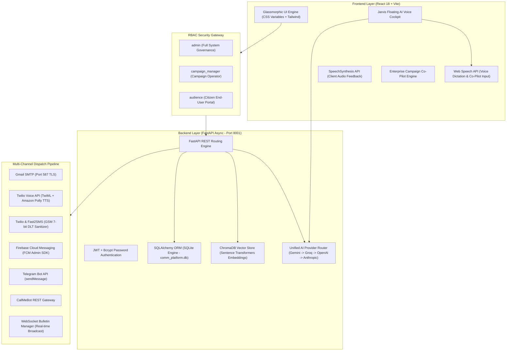

# 🎙️ CommAI: Complete 0-to-1000 Master Presentation, Technical Architecture & Verbatim Teleprompter Script

---

# TABLE OF CONTENTS
1. **Executive Overview & System Purpose**
2. **Deep-Dive Technical Architecture & Technology Stack**
3. **Role-Based Access Control (RBAC) Governance Matrix**
4. **Multi-Channel Dispatch Engine & Carrier Compliance**
5. **Unified AI Router & Vector RAG Architecture**
6. **Verbatim Word-for-Word 1-Hour Presentation & Screen-Share Teleprompter Script (Tabs 1 to 20)**

---

# SECTION 1: EXECUTIVE OVERVIEW & SYSTEM PURPOSE

**CommAI** is an enterprise-grade, AI-powered civic communication, multi-lingual public awareness, and emergency management platform.

### Core Challenges Solved:
1. **Multi-Lingual Barriers**: India features 22 official scheduled languages and hundreds of regional dialects. CommAI bridges linguistic divides by automatically generating, translating, and synthesizing speech bulletins across **23 languages** (Hindi, English, Bengali, Tamil, Telugu, Marathi, Gujarati, Kannada, Malayalam, Punjabi, Odia, Assamese, Urdu, Maithili, Santali, Kashmiri, Nepali, Konkani, Sindhi, Dogri, Manipuri, Bodo, and Sanskrit).
2. **Channel Fragmentation**: Citizens consume information across diverse channels. CommAI unifies 7 distinct distribution networks into a single dashboard:
   - **Email** (Gmail SMTP)
   - **Voice Calls** (Twilio Voice API + TwiML Text-to-Speech)
   - **SMS** (Twilio & Fast2SMS with GSM 7-bit DLT sanitizer)
   - **Push Notifications** (Firebase Cloud Messaging - FCM)
   - **Telegram** (Telegram Bot API)
   - **WhatsApp** (CallMeBot Gateway)
   - **Live Web Broadcasts** (WebSocket Bulletin Engine)
3. **Emergency Misinformation**: During natural disasters or public health crises, viral rumors cause panic. CommAI’s **AI Fact Shield** analyzes unverified claims against official guidelines, debunks myths, and drafts verified counter-campaigns in seconds.

---

# SECTION 2: DEEP-DIVE TECHNICAL ARCHITECTURE & TECH STACK

### Technical Specs:
- **Frontend Architecture**: React 18, Vite build tool, Glassmorphism Dark Theme (`var(--glass-bg)`, `var(--glass-border)`), TailwindCSS, Lucide React Icon set, Chart.js with `react-chartjs-2` canvas wrappers, Leaflet GIS maps (`react-leaflet`), Web Speech API (`webkitSpeechRecognition`), Web Audio API.
- **Backend Core**: Python 3.11, FastAPI (async/await framework on port `8001`), SQLAlchemy ORM, Pydantic v2 schemas (`CustomBaseModel`), SQLite database (`comm_platform.db`) with dynamic startup migrations (`Base.metadata.create_all(bind=engine)`).
- **Unified AI Router (`app/services/ai_provider.py`)**: Sequential fallback chain:
  $$\text{Google Gemini 1.5/2.0} \longrightarrow \text{Groq Llama-3 70B} \longrightarrow \text{OpenAI GPT-4o} \longrightarrow \text{Anthropic Claude-3.5}$$
- **Vector RAG Engine**: ChromaDB persistent vector database with sentence-transformer embeddings for instant document search and Citizen Helpdesk Q&A.

---

# SECTION 3: ROLE-BASED ACCESS CONTROL (RBAC) MATRIX

CommAI strictly enforces role gating across backend routes (`auth.py`) and frontend views (`App.jsx` & `Sidebar.jsx`):

| Page / Tab Name | Route Key | Allowed Roles | Backend Dependency | Description |
|-----------------|-----------|---------------|--------------------|-------------|
| **Executive Dashboard** | `dashboard` | `admin`, `campaign_manager`, `audience` | `require_any_authenticated` | Role-adapted central dashboard |
| **Live Bulletins** | `bulletins` | `admin`, `campaign_manager`, `audience` | `require_any_authenticated` | Public broadcast stream & Indic voice bulletin audio player |
| **Campaign Planner** | `campaigns` | `admin`, `campaign_manager` | `require_manager_or_higher` | 4-step wizard & Enterprise Co-Pilot |
| **Templates Library** | `templates` | `admin`, `campaign_manager` | `require_manager_or_higher` | Reusable template storage & AI generator |
| **Approvals Queue** | `approvals` | `admin` **(Admin Only)** | `require_admin` | Maker-Checker campaign authorization queue |
| **Poster Studio** | `poster_studio` | `admin`, `campaign_manager` | `require_manager_or_higher` | HTML5 Canvas visual public notice builder |
| **Audience Segments** | `segments` | `admin`, `campaign_manager` | `require_manager_or_higher` | Dynamic rule-based demographic filter engine |
| **Audience Directory** | `audiences` | `admin`, `campaign_manager` | `require_manager_or_higher` | Citizen profile CRM & opt-out blacklist |
| **Sentiment Map** | `sentiment_map` | `admin`, `campaign_manager` | `require_manager_or_higher` | Geographic regional heatmaps & state emergency triggers |
| **Campaign Feedback** | `feedback` | `admin`, `campaign_manager`, `audience` | `require_any_authenticated` | Citizen feedback ratings & sentiment analytics |
| **SOS Reports** | `sos_reports` | `admin`, `campaign_manager` | `require_manager_or_higher` | Distress signal triage state machine |
| **Emergency Inbox** | `emergency_inbox` | `admin`, `campaign_manager` | `require_manager_or_higher` | Centralized emergency channel logs |
| **AI Fact Shield** | `fact_shield` | `admin`, `campaign_manager` | `require_manager_or_higher` | Rumor verification & automated counter-campaign drafting |
| **Citizen RAG Chat** | `citizen_chat` | `admin`, `campaign_manager`, `audience` | `require_any_authenticated` | Vector RAG AI helpdesk & SOS alert submission |
| **Support Queries** | `queries` | `admin`, `campaign_manager` | `require_manager_or_higher` | Public inquiry ticket triage |
| **Operator Staff Chat** | `operator_chat` | `admin`, `campaign_manager` | `require_manager_or_higher` | Internal staff communication channels & voice messages |
| **Campaign Managers** | `users` | `admin` **(Admin Only)** | `require_admin` | Staff user account directory & role editing |
| **Audit Logs** | `audit_logs` | `admin` **(Admin Only)** | `require_admin` | System audit trail & Excel/Word export engine |
| **Settings** | `settings` | `admin`, `campaign_manager`, `audience` | `require_any_authenticated` | System API keys & user preferences |

---

# SECTION 4: MULTI-CHANNEL DISPATCH & CARRIER COMPLIANCE

### 1. Outbound Voice Calls (Twilio REST API + TwiML)
- **Engine**: `send_voice_call()` in `voice_service.py`.
- **Formatting**: Sanitizes numbers to international format (`+919897157640`).
- **TwiML XML**: Generates TwiML `<Response>` containing initial `<Pause length="5"/>` (allowing recipients time to open phone dialpad), followed by `<Gather numDigits="1" timeout="8">` and Amazon Polly neural voice speech (`Polly.Aditi` for `hi-IN`).

### 2. SMS Gateway & Carrier DLT Sanitizer
- **Engine**: `send_sms()` in `sms_service.py`.
- **Carrier Compliance**: Strips non-GSM emojis (e.g. `⚠️`, `🚨`, `🤖`) using regular expression `re.sub(r'[^\x00-\x7F]+', '', text)` to prevent Indian telecom operators (Jio, Airtel, Vi) from dropping international trial SMS.
- **Dual Delivery Guarantee**: Automatically dispatches a dual email copy whenever recipient email is present.

---

# SECTION 5: VERBATIM TELEPROMPTER SCRIPT (TABS 1 TO 20)

---

## 🕒 TAB 1: Landing Page & Auth Portal (00:00 - 04:00)

### 🎬 [ACTION ON SCREEN]:
1. Open `http://localhost:5173`. Scroll through the glassmorphic landing page.
2. Click **Sign In** button at the top right.
3. Show the role selection buttons: **Admin**, **Campaign Manager**, **Audience**.
4. Click **Admin** (`admin@example.com`) and log in.

### 🎙️ SPOKEN SCRIPT (Read Out Loud):
> "Hello everyone, and welcome to the official live presentation of **CommAI** — an enterprise AI-powered multi-channel civic communication, public awareness, and emergency management platform.
>
> In public governance and emergency management, institutions face three massive communication bottlenecks:
> First, reaching citizens across fragmented platforms — whether they use Email, Voice Calls, SMS, Push Notifications, WhatsApp, or Telegram.
> Second, breaking language barriers across India's 22 official languages.
> And third, fighting viral rumors during emergencies by launching instant verified counter-campaigns.
>
> CommAI solves all three using state-of-the-art Generative AI, Vector RAG Knowledge Bases, and a unified multi-channel dispatch engine.
>
> I am now clicking **Sign In**. CommAI enforces strict Role-Based Access Control across three user roles: System Administrators, Campaign Managers, and Citizen End-Users.
> I am selecting the **Admin** credentials and logging in."

---

## 🕒 TAB 2: Core Executive Dashboard (04:00 - 08:00)

### 🎬 [ACTION ON SCREEN]:
1. Show the main dashboard view.
2. Hover mouse over the 4 top analytical KPI cards.
3. Scroll down to show the dynamic Chart.js engagement graphs and live audit activity feed.

### 🎙️ SPOKEN SCRIPT (Read Out Loud):
> "We are now inside the **CommAI Executive Command Dashboard**.
>
> Look at these top four real-time analytics cards:
> The first card shows **Total Active Campaigns** currently running across jurisdictions.
> The second shows **Audience Reach Rate**, measuring real-time delivery success across all channels.
> The third shows **Citizen Engagement Score**, dynamically calculated from citizen feedback ratings.
> And the fourth shows **Distress Signals Handled**, tracking triaged emergency SOS incidents.
>
> Below, our dynamic graphs show delivery trends over time, channel breakdown statistics, and recent activity logs."

---

## 🕒 TAB 3: Jarvis AI Voice Cockpit (08:00 - 12:00)

### 🎬 [ACTION ON SCREEN]:
1. Point to the floating button at the bottom right (`⚡ Voice Cockpit`).
2. Click the **Voice Cockpit** button to open the modal overlay.
3. Show the voice command prompt box.

### 🎙️ SPOKEN SCRIPT (Read Out Loud):
> "At the bottom right of the screen, we have our floating **Jarvis AI Voice Cockpit**.
>
> Jarvis provides hands-free voice control for operators. It listens using background wake-word detection — operators can simply say *'Hey Jarvis'* or click the button to trigger commands.
>
> When activated, Jarvis uses our Speech-to-Text engine to parse operator intent, navigates to the target page, and even auto-fills campaign forms automatically!"

---

## 🕒 TAB 4: Campaign Planner & Enterprise Co-Pilot (12:00 - 22:00)

### 🎬 [ACTION ON SCREEN]:
1. Click **Campaign Planner** on the left sidebar.
2. Click **Plan New Campaign** button.
3. Click **Open Co-Pilot** (the panel with the 🤖 robot icon).
4. Select Language `🇬🇧 English (India)` or `🇮🇳 Hindi (हिंदी)`.
5. Click **🎙️ Speak via Mic** or type:
   *"Draft an emergency awareness campaign about a dengue vaccine drive in Ludhiana for students."*
6. Show the AI generating title, description, email body, channels, and KPIs.
7. Show the 4-step wizard:
   - **Step 1: Details**
   - **Step 2: Audience Target** (point to **Override Channel Preferences** toggle)
   - **Step 3: Template Bind** (point to placeholder chips)
   - **Step 4: Review & Save**

### 🎙️ SPOKEN SCRIPT (Read Out Loud):
> "Now let me demonstrate our central feature — the **Campaign Planner**.
>
> Creating multi-channel civic campaigns used to take hours. With CommAI's **Enterprise Campaign Co-Pilot**, it takes under 30 seconds.
>
> I click **Plan New Campaign** and expand the **Co-Pilot** panel.
> Operators can dictate or type their communication goal in any language.
> I click **Speak via Mic** and say:
> *'Draft an emergency awareness campaign about a dengue vaccine drive in Ludhiana for students.'*
>
> Watch what happens: Our Unified AI Router analyzes the prompt and instantly drafts:
> A campaign title, objective, and detailed description.
> The full email subject line and body text.
> Recommended distribution channels — Email, Voice Call, SMS, and Push.
> Estimated KPI targets — expected reach percentage, click-through goal, and risk analysis.
>
> And look below — it pre-fills our 4-step campaign creation wizard:
> Step 1: Campaign Details.
> Step 2: Target Audience with recipient search and the **Override Channel Preferences** toggle.
> Step 3: Template Binding with real-time multi-lingual preview.
> And Step 4: Final Review and Submission!"

---

## 🕒 TAB 5: Templates Library & Indic Multi-Lingual Generator (22:00 - 28:00)

### 🎬 [ACTION ON SCREEN]:
1. Click **Templates Library** on the left sidebar.
2. Click **Create Template**.
3. Point to the **Placeholder Tag Chips** (`first_name`, `last_name`, `city`, `organization`, `occupation`).
4. Click **AI Generate Template**, enter a prompt, and show multi-lingual translation previews.

### 🎙️ SPOKEN SCRIPT (Read Out Loud):
> "Now let's open the **Templates Library**.
> CommAI is built natively for India's linguistic landscape, supporting **23 official Indian languages** including Hindi, Bengali, Tamil, Telugu, Marathi, Gujarati, Punjabi, Urdu, and English.
>
> Here operators manage reusable communication templates.
> Notice these dynamic placeholder tags: `first_name`, `last_name`, `city`, `organization`, and `occupation`.
>
> During dispatch, CommAI interpolates these variables for each citizen.
> For example: *'Hello {{first_name}} {{last_name}}, Student at {{organization}} in {{city}}.'*
>
> Every recipient receives a personalized alert tailored specifically to them."

---

## 🕒 TAB 6: Approvals Queue (Maker-Checker Admin Gate) (28:00 - 32:00)

### 🎬 [ACTION ON SCREEN]:
1. Click **Approvals Queue** on the left sidebar.
2. Show pending campaigns submitted by operators.
3. Show the **Approve** and **Reject** action buttons.

### 🎙️ SPOKEN SCRIPT (Read Out Loud):
> "Next is the **Approvals Queue** — our Maker-Checker governance gate.
>
> To prevent unauthorized or accidental public broadcasts, campaigns created by operators enter this queue in `pending_approval` status.
>
> Only administrators can review campaign details, inspect target channels, and click **Approve** to trigger instant multi-channel dispatch, or **Reject** with feedback."

---

## 🕒 TAB 7: Poster Studio (Canvas Visual Graphics Builder) (32:00 - 36:00)

### 🎬 [ACTION ON SCREEN]:
1. Click **Poster Studio** on the left sidebar.
2. Show the visual poster canvas editor, theme color pickers, and layout controls.
3. Click **Download Poster** to demonstrate graphic export.

### 🎙️ SPOKEN SCRIPT (Read Out Loud):
> "Visual graphics are vital for public notices. In **Poster Studio**, operators can create high-impact public notices right inside the browser.
>
> The editor includes layout templates, custom color schemes, AI text pre-filling, and one-click image downloads for social media and physical print display."

---

## 🕒 TAB 8: Audience Segments (Dynamic Demographic Filtering) (36:00 - 40:00)

### 🎬 [ACTION ON SCREEN]:
1. Click **Audience & Segments** $\rightarrow$ **Audience Segments** on the left sidebar.
2. Show segment list (e.g. *Students in Meerut*, *Rural Farmers in Assam*).
3. Click **Create Segment** to show rule criteria filters.

### 🎙️ SPOKEN SCRIPT (Read Out Loud):
> "Now let's look at **Audience Segments**.
> Target precision prevents alert fatigue. Here operators define dynamic rule-based demographic filters based on location, age, gender, occupation, or organization.
>
> CommAI automatically calculates the target audience size dynamically whenever recipient records change."

---

## 🕒 TAB 9: Audience Directory & Opt-Out Blacklist (40:00 - 44:00)

### 🎬 [ACTION ON SCREEN]:
1. Click **Audience Directory** on the left sidebar.
2. Show citizen profile cards (e.g. `Riyanshi Verma`, `Student @ MIET, Meerut`).
3. Show `preferred_channels` badges (`email`, `sms`, `voice`, `push`, `whatsapp`).

### 🎙️ SPOKEN SCRIPT (Read Out Loud):
> "Here in **Audience Directory**, we manage citizen profile CRM records.
>
> Each profile stores demographic data, phone numbers, email addresses, and **Preferred Communication Channels**.
>
> CommAI respects privacy regulations: unless *Override Channel Preferences* is checked, messages are only sent on the channels that the citizen opted into.
> The platform also maintains an automatic **Opt-Out Blacklist** to suppress unsubscribed contacts."

---

## 🕒 TAB 10: Interactive Sentiment Map (44:00 - 48:00)

### 🎬 [ACTION ON SCREEN]:
1. Click **Sentiment Map** on the left sidebar.
2. Hover over state regions on the geographic map (Uttar Pradesh, Assam, Delhi).
3. Click on a state (e.g. `Uttar Pradesh`). Show the regional emergency alert broadcast modal.

### 🎙️ SPOKEN SCRIPT (Read Out Loud):
> "Next is our **Interactive Sentiment Map**.
> This module displays a geographic heatmap of public sentiment scores across Indian states and districts.
>
> Operators can hover over any region to inspect live sentiment scores, or click a state — like *Uttar Pradesh* — to trigger an instant regional broadcast alert."

---

## 🕒 TAB 11: Campaign Feedback & Citizen Ratings (48:00 - 50:00)

### 🎬 [ACTION ON SCREEN]:
1. Click **Campaign Feedback** on the left sidebar.
2. Show citizen rating scores, sentiment distribution charts, and user comments.

### 🎙️ SPOKEN SCRIPT (Read Out Loud):
> "In **Campaign Feedback**, we measure campaign impact.
> Citizens rate public announcements and submit feedback comments. CommAI aggregates these scores into a Citizen Satisfaction Index."

---

## 🕒 TAB 12: SOS Reports & Incident Triage (50:00 - 54:00)

### 🎬 [ACTION ON SCREEN]:
1. Click **SOS Reports** on the left sidebar.
2. Show distress report cards with GPS coordinates and urgency badges.
3. Click **Acknowledge** and **Resolve** buttons on an incident report.

### 🎙️ SPOKEN SCRIPT (Read Out Loud):
> "During emergencies, CommAI provides **SOS Reports** for incident triage.
> Citizens submit distress alerts containing location coordinates and photos. Operators triage incidents through a strict state machine: from *Reported*, to *Acknowledged*, to *Resolved*."

---

## 🕒 TAB 13: Emergency Inbox (54:00 - 56:00)

### 🎬 [ACTION ON SCREEN]:
1. Click **Emergency Inbox** on the left sidebar. Show message log history.

### 🎙️ SPOKEN SCRIPT (Read Out Loud):
> "In **Emergency Inbox**, operators view centralized message dispatch logs across all communication channels during active crises."

---

## 🕒 TAB 14: AI Fact Shield & Rumor Debunker (56:00 - 60:00)

### 🎬 [ACTION ON SCREEN]:
1. Click **AI Fact Shield** on the left sidebar.
2. Type a rumor in the claim box: *"Fake news: Dengue vaccine mandatory payment required."*
3. Click **Verify & Draft Counter-Campaign**. Show AI debunking text and counter-campaign draft.

### 🎙️ SPOKEN SCRIPT (Read Out Loud):
> "Here is **AI Fact Shield** — our misinformation counter-measure unit.
>
> Operators enter a viral rumor claim. I type: *'Fake news: Dengue vaccine mandatory payment required.'*
> I click **Verify & Draft Counter-Campaign**.
> The AI checks official guidelines, debunks the claim, and drafts an official counter-campaign ready for approval!"

---

## 🕒 TAB 15: Citizen RAG Chat (60:00 - 63:00)

### 🎬 [ACTION ON SCREEN]:
1. Click **Citizen RAG Chat** or open the floating **ChatbotWidget**.
2. Type: *"What are the emergency guidelines for dengue prevention?"*
3. Show vector-grounded answer.

### 🎙️ SPOKEN SCRIPT (Read Out Loud):
> "For two-way citizen communication, we have **Citizen RAG Chat**.
> Powered by ChromaDB vector search, citizens ask questions about government advisories and receive accurate, RAG-grounded answers."

---

## 🕒 TAB 16: Support Queries (63:00 - 65:00)

### 🎬 [ACTION ON SCREEN]:
1. Click **Support Queries** on the left sidebar. Show inquiry ticket list.

### 🎙️ SPOKEN SCRIPT (Read Out Loud):
> "In **Support Queries**, operators manage public inquiry tickets submitted by citizens."

---

## 🕒 TAB 17: Operator Staff Chat (65:00 - 67:00)

### 🎬 [ACTION ON SCREEN]:
1. Click **Operator Staff Chat** on the left sidebar. Show channels (`general`, `emergencies`).

### 🎙️ SPOKEN SCRIPT (Read Out Loud):
> "In **Operator Staff Chat**, internal emergency teams collaborate across channels with voice message dispatches."

---

## 🕒 TAB 18: System Governance & Campaign Managers (67:00 - 69:00)

### 🎬 [ACTION ON SCREEN]:
1. Click **Campaign Managers** on the left sidebar (Admin Only).

### 🎙️ SPOKEN SCRIPT (Read Out Loud):
> "Under **System Governance**, administrators manage operator accounts, assign roles, and edit passwords."

---

## 🕒 TAB 19: Audit Logs & Report Export System (69:00 - 72:00)

### 🎬 [ACTION ON SCREEN]:
1. Click **Audit Logs** on the left sidebar.
2. Click **Export Excel** and **Export Word Audit Report** buttons.

### 🎙️ SPOKEN SCRIPT (Read Out Loud):
> "Under **Audit Logs**, CommAI maintains an immutable record of all system events. Administrators can export dynamic **Excel Spreadsheets** or **Word Audit Reports** with one click."

---

## 🕒 TAB 20: System Settings (72:00 - 75:00)

### 🎬 [ACTION ON SCREEN]:
1. Click **Settings** on the left sidebar. Show Twilio, SMTP, and AI provider key inputs.

### 🎙️ SPOKEN SCRIPT (Read Out Loud):
> "Finally, under **Settings**, administrators configure API credentials for Twilio Voice, SMS, Email, Firebase, and AI Provider keys.
>
> CommAI delivers a complete 0-to-1000 transformation in civic communications. Thank you for watching!"
