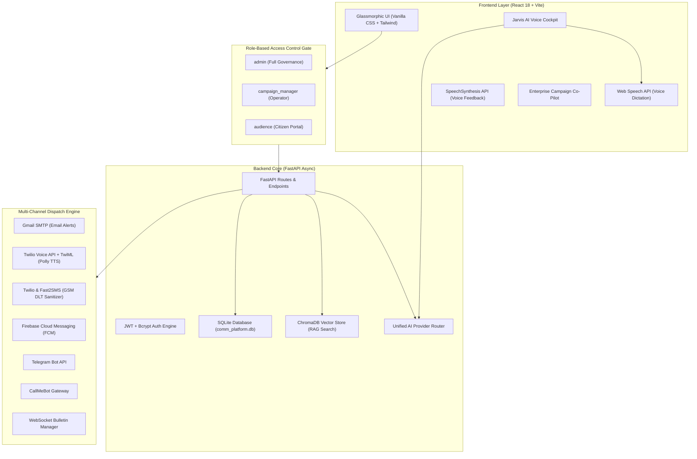

# 🎙️ CommAI: Master 1-Hour End-to-End Walkthrough Script & Technical Architecture Guide

Welcome to the **Master Walkthrough Script** for **CommAI** — the enterprise AI-powered multi-channel civic communication, public awareness, and emergency response platform.

This comprehensive guide is designed for **1-hour live demonstrations, investor pitches, technical audits, and complete product walkthroughs**. It covers every feature, every tab, every role gate, and every underlying engineering mechanism from **0 to 1000**.

---

## 🏗️ 1. Complete Technology Stack & Architecture (0 to 1000)

Before beginning the live walkthrough, here is the complete technical architecture powering CommAI:

### Key Technical Specs:
- **Frontend**: React 18, Vite, Glassmorphism Dark Theme, Lucide Icons, Chart.js, Leaflet Maps, Web Speech API (STT), SpeechSynthesis API (TTS).
- **Backend**: Python 3.11, FastAPI (async/await framework running on port `8001`), SQLAlchemy ORM, Pydantic v2 schemas.
- **Database**: SQLite (`comm_platform.db`) with dynamic schema migration on startup.
- **Unified AI Router**: `app/services/ai_provider.py` with multi-tier sequential LLM fallback:
  $$\text{Google Gemini} \longrightarrow \text{Groq Llama-3} \longrightarrow \text{OpenAI GPT-4o} \longrightarrow \text{Anthropic Claude-3.5}$$
- **Voice Engine**: Microsoft Neural (`edge-tts`) with 23 Indic languages + Google TTS (`gTTS`) + Amazon Polly via Twilio TwiML.

---

## 🔐 2. Role-Based Access Control (RBAC) Matrix

CommAI strictly enforces role-gating across all endpoints and UI views:

| Sidebar Section / Page | Route Key | Allowed Roles | Description |
|-----------------------|-----------|---------------|-------------|
| **Dashboard** | `dashboard` | `admin`, `campaign_manager`, `audience` | Role-adapted central portal (Admin analytics vs Citizen hub) |
| **Live Bulletins** | `bulletins` | `admin`, `campaign_manager`, `audience` | Public broadcast stream & audio bulletin playback |
| **Campaign Planner** | `campaigns` | `admin`, `campaign_manager` | 4-step creation wizard & Enterprise Co-Pilot |
| **Templates Library** | `templates` | `admin`, `campaign_manager` | AI multi-lingual template generator & 23 Indic languages |
| **Approvals Queue** | `approvals` | `admin` **(Admin Only)** | Maker-Checker review queue for submitted campaigns |
| **Poster Studio** | `poster_studio` | `admin`, `campaign_manager` | Canvas graphic poster generator & AI layout builder |
| **Audience Segments** | `segments` | `admin`, `campaign_manager` | Dynamic rule-based demographic segmentation |
| **Audience Directory** | `audiences` | `admin`, `campaign_manager` | Recipient directory, preferred channels & opt-out blacklist |
| **Sentiment Map** | `sentiment_map` | `admin`, `campaign_manager` | State/District heatmaps & emergency regional alerts |
| **Campaign Feedback** | `feedback` | `admin`, `campaign_manager`, `audience` | Citizen rating & feedback submission portal |
| **SOS Reports** | `sos_reports` | `admin`, `campaign_manager` | Distress signal triage (`reported` $\rightarrow$ `acknowledged` $\rightarrow$ `resolved`) |
| **Emergency Inbox** | `emergency_inbox` | `admin`, `campaign_manager` | Real-time emergency channel dispatches & coordinates |
| **AI Fact Shield** | `fact_shield` | `admin`, `campaign_manager` | Rumor detector & automated counter-campaign generator |
| **Citizen RAG Chat** | `citizen_chat` | `admin`, `campaign_manager`, `audience` | Vector RAG AI helpdesk & emergency SOS submission |
| **Support Queries** | `queries` | `admin`, `campaign_manager` | Public citizen inquiry ticket triage |
| **Operator Staff Chat** | `operator_chat` | `admin`, `campaign_manager` | Internal staff communication with voice message dispatches |
| **Campaign Managers** | `users` | `admin` **(Admin Only)** | Staff user management & role elevation |
| **Audit Logs** | `audit_logs` | `admin` **(Admin Only)** | System audit logs & on-demand Excel/Word report generation |
| **Settings** | `settings` | `admin`, `campaign_manager`, `audience` | System API keys & user preference config |

---

## 🎬 3. Master 1-Hour Presentation & Demo Script

---

### ⏱️ Phase 1: Landing Page & Authentication (00:00 - 08:00)

#### 🎙️ Presenter Script:
> *"Good day everyone! Welcome to **CommAI** — the next-generation AI-driven civic communication, public awareness, and emergency management platform.*
> 
> *In today's fast-moving world, public institutions and enterprise communications teams face three massive challenges:*
> 1. **Multi-lingual barriers**: Communicating across diverse languages in real-time.
> 2. **Channel fragmentation**: Reaching citizens where they are — SMS, Voice Calls, Email, WhatsApp, Telegram, and Push Notifications.
> 3. **Emergency misinformation**: Verifying rumors instantly and launching verified counter-campaigns.
> 
> *CommAI solves all three using state-of-the-art Generative AI, RAG Knowledge Bases, and a unified multi-channel dispatch engine. Let's log in to experience the system."*

#### 💻 Actions & Highlights to Show:
1. Open the landing page (`http://localhost:5173`). Show the glassmorphic dark-theme UI.
2. Click **Sign In**. Show the role-selection demo credentials:
   - **Admin** (`admin@example.com`): System governance & approval rights.
   - **Campaign Manager** (`manager@example.com`): Operational campaign manager.
   - **Citizen Audience** (`riyanshi.verma.55@gmail.com`): Citizen public portal.
3. Log in as **Admin**.

---

### ⏱️ Phase 2: Core Dashboard & Dynamic Analytics (08:00 - 15:00)

#### 🎙️ Presenter Script:
> *"Upon logging in, we are greeted by the **CommAI Executive Command Dashboard**. Notice how the system instantly calculates real-time metrics dynamically from SQLite:*
> - **Total Active Campaigns**: Live public announcements running across jurisdictions.
> - **Audience Reach Rate**: Real-time delivery success across all connected communication channels.
> - **Citizen Engagement Score**: Aggregated sentiment score calculated from citizen feedback.
> - **Distress Signals Handled**: Real-time SOS alerts triaged by emergency operators.
> 
> *At the bottom right, notice our floating **Jarvis AI Voice Cockpit**. Jarvis operates hands-free using background wake-word detection — you can simply say 'Hey Jarvis' or click the cockpit button to dictate commands."*

#### 💻 Actions & Highlights to Show:
1. Highlight the top statistical KPI cards and glassmorphic charts.
2. Click the floating **Voice Cockpit** button (`⚡ Voice Cockpit`).
3. Demonstrate Jarvis greeting: *"Hello admin, what do you want to do?"*
4. Show the voice intent engine analyzing commands dynamically.

---

### ⏱️ Phase 3: AI Campaign Planner & Enterprise Co-Pilot (15:00 - 25:00)

#### 🎙️ Presenter Script:
> *"Now let's explore our flagship module — the **Campaign Planner**. Creating multi-channel civic campaigns used to take hours. With CommAI's **Enterprise Campaign Co-Pilot**, it takes under 30 seconds.*
> 
> *Let's expand the Co-Pilot. We can type or speak our communication goal in any of 13 Indian languages. For example: 'Draft an emergency awareness drive about dengue prevention in Meerut for students.'*
> 
> *Watch as our Unified AI Provider Router (Gemini + Groq + OpenAI) instantly drafts:*
> - *A optimized title, objective, and description.*
> - *The complete email subject line and body text.*
> - *Recommended distribution channels (Email, Voice Call, SMS, Push).*
> - *Estimated KPI targets: Expected reach %, CTR goal, and risk analysis.*
> - *Automatic 4-step wizard pre-filling!"*

#### 💻 Actions & Highlights to Show:
1. Navigate to **Campaign Planner** in sidebar.
2. Click **Plan New Campaign** $\rightarrow$ Click **Open Co-Pilot**.
3. Select Language: `🇬🇧 English (India)` or `🇮🇳 Hindi (हिंदी)`.
4. Click **🎙️ Speak via Mic** or type prompt: *"Draft an urgent public advisory warning students against fraudulent internship registration fee scams in Meerut."*
5. Show the Co-Pilot generating full campaign metadata, risk breakdown, and KPIs.
6. Show the 4-step wizard:
   - **Step 1: Details**: Title, category, objective.
   - **Step 2: Audience Target**: Segment selection, recipient search, **Override Channel Preferences** toggle.
   - **Step 3: Template Bind**: Custom text vs template binding, real-time multi-lingual preview.
   - **Step 4: Review & Save**: Final submission to Maker-Checker queue or instant launch.

---

### ⏱️ Phase 4: Template Library & Indic Multi-Lingual Generator (25:00 - 32:00)

#### 🎙️ Presenter Script:
> *"CommAI is built natively for India's linguistic diversity, supporting **23 official Indian languages** (Hindi, Bengali, Tamil, Telugu, Marathi, Gujarati, Kannada, Malayalam, Punjabi, Odia, Assamese, Urdu, etc.).*
> 
> *In the **Templates Library**, operators can store reusable communication templates containing dynamic personalization tags such as `{{first_name}}`, `{{last_name}}`, `{{city}}`, `{{organization}}`, and `{{occupation}}`.*
> 
> *Our Translation Engine automatically translates campaign templates on the fly while strictly preserving placeholder tags so every citizen receives personalized alerts in their native language."*

#### 💻 Actions & Highlights to Show:
1. Navigate to **Templates Library**.
2. Click **Create Template** or inspect existing templates.
3. Show the **Placeholder Tag Chips** (`Recipient Name`, `City`, `Occupation`, `Organization`).
4. Click **AI Generate Template** $\rightarrow$ Enter prompt $\rightarrow$ Show multi-lingual translation preview.

---

### ⏱️ Phase 5: Audience Directory & Dynamic Segmentation (32:00 - 38:00)

#### 🎙️ Presenter Script:
> *"A campaign is only as effective as its target audience. In **Audience & Segments**, CommAI provides a comprehensive CRM for civic profiling.*
> 
> *Here we manage:*
> - **Citizen Demographics**: State, district, city, age, gender, occupation, organization.
> - **Channel Preferences**: Preferred delivery channels per citizen (e.g. Email, Voice Call, SMS, WhatsApp).
> - **Opt-Out Blacklist**: Automatic suppression of blacklisted emails or phone numbers to comply with privacy regulations.
> - **Dynamic Segments**: Rule-based demographic filters (e.g., 'Farmers in Assam' or 'Students in Meerut') that automatically recalculate estimated target size."*

#### 💻 Actions & Highlights to Show:
1. Navigate to **Audience Directory**. Show citizen profiles (e.g. `Riyanshi Verma`, `Student @ MIET, Meerut`).
2. Show `preferred_channels` tags (`email`, `sms`, `voice`, `push`, `whatsapp`).
3. Navigate to **Audience Segments**. Show dynamic rule filters.

---

### ⏱️ Phase 6: Emergency Operations & Distress Signals (38:00 - 45:00)

#### 🎙️ Presenter Script:
> *"During public emergencies, quick incident triage saves lives. In **Emergency Operations**, we manage three critical tools:*
> 
> 1. **SOS Reports**: Real-time distress signals submitted by citizens. Each report tracks location coordinates, urgency level, and follows a strict state machine: `reported` $\longrightarrow$ `acknowledged` $\longrightarrow$ `resolved`.
> 2. **Emergency Inbox**: Centralized message dispatch logs across all communication channels.
> 3. **AI Fact Shield**: Misinformation and rumor counter-measure unit. Operators submit a viral rumor claim. The AI analyzes the claim against verified government guidelines, drafts a fact-check counter-campaign, and pushes it directly into the approval queue."*

#### 💻 Actions & Highlights to Show:
1. Navigate to **SOS Reports**. Show incident status buttons (`Acknowledge`, `Resolve`).
2. Navigate to **Emergency Inbox**. Show real-time message logs.
3. Navigate to **AI Fact Shield**. Demonstrate entering a rumor claim: *"Fake news: Dengue vaccine mandatory payment required."* $\rightarrow$ Show AI drafting fact-check counter-campaign.

---

### ⏱️ Phase 7: Interactive Sentiment Map & Poster Studio (45:00 - 52:00)

#### 🎙️ Presenter Script:
> *"Visual communication is essential for public engagement. CommAI provides two powerful creative modules:*
> 
> 1. **Sentiment Map**: An interactive geographic heatmap displaying public sentiment scores across Indian states and districts (Uttar Pradesh, Assam, Maharashtra, Delhi, etc.). Operators can click any state to launch an emergency regional broadcast.
> 2. **Poster Studio**: An in-browser canvas graphic generator. Operators can design visual public notice posters, pre-fill text with AI, and download high-resolution graphics for print or social media."*

#### 💻 Actions & Highlights to Show:
1. Navigate to **Sentiment Map**. Click a state (e.g. `Uttar Pradesh`) $\rightarrow$ Show regional alert trigger modal.
2. Navigate to **Poster Studio**. Show canvas customization, template selection, and image export.

---

### ⏱️ Phase 8: Help Desk, Citizen RAG Chat & Staff Chat (52:00 - 57:00)

#### 🎙️ Presenter Script:
> *"Communication must be two-way. CommAI features three dedicated chat engines:*
> 
> 1. **Citizen RAG Chat**: Powered by ChromaDB vector search. Citizens can ask questions about official government schemes or public advisories and receive accurate, RAG-grounded answers. Citizens can also submit emergency SOS alerts directly through the chatbot widget.
> 2. **Support Queries**: Ticket triage system for operator staff to manage public inquiries.
> 3. **Operator Staff Chat**: Internal channels (`general`, `emergencies`, `announcements`) for team collaboration, featuring voice message dispatches."*

#### 💻 Actions & Highlights to Show:
1. Open **Citizen RAG Chat** or the floating **ChatbotWidget**. Show RAG query answering and SOS submission.
2. Navigate to **Operator Staff Chat**. Show internal channels and message posting.

---

### ⏱️ Phase 9: System Governance, Audit Logs & Data Export (57:00 - 60:00)

#### 🎙️ Presenter Script:
> *"Finally, enterprise security and transparency are paramount. Under **System Governance** (Admin Only):*
> 
> - **Campaign Managers Directory**: Managing operator staff, passwords, and permissions.
> - **Approvals Queue**: Maker-Checker authorization. Campaigns submitted by managers enter the queue for Admin review before dispatch.
> - **Audit Logs**: Immutable log recording every single action, status change, and login event.
> - **On-Demand Reports**: One-click dynamic export of the SQLite database into professional **Excel Spreadsheets** (`export_database_to_excel.py`) and **Word Audit Reports** (`export_database_to_word.py`).
> 
> *Thank you! CommAI represents a total 0-to-1000 transformation in civic communications."*

#### 💻 Actions & Highlights to Show:
1. Navigate to **Campaign Managers** (show RBAC gate).
2. Navigate to **Audit Logs**. Show system event logs.
3. Show export buttons for Excel and Word reports.

---

## 🛠️ 4. Quick Reference Checklist for Demonstration

- [x] Backend running on `http://localhost:8001` (FastAPI `uvicorn main:app --reload`)
- [x] Frontend running on `http://localhost:5173` (React Vite HMR)
- [x] SQLite database seeded (`comm_platform.db`)
- [x] Twilio Voice & SMS configured with verified recipient phone numbers
- [x] Gmail SMTP configured for live email alerts
- [x] Microphone permission allowed in browser for Jarvis Voice Cockpit & Co-Pilot
